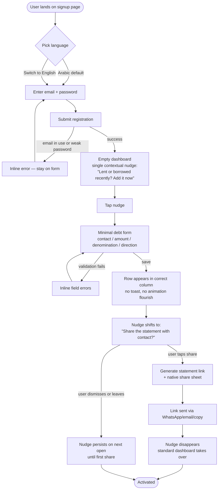
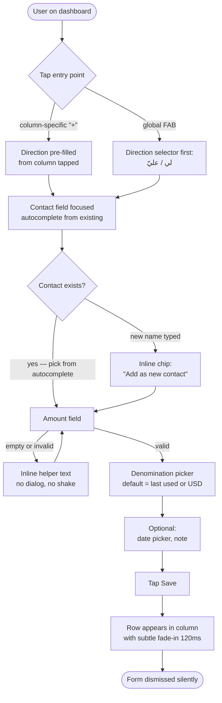
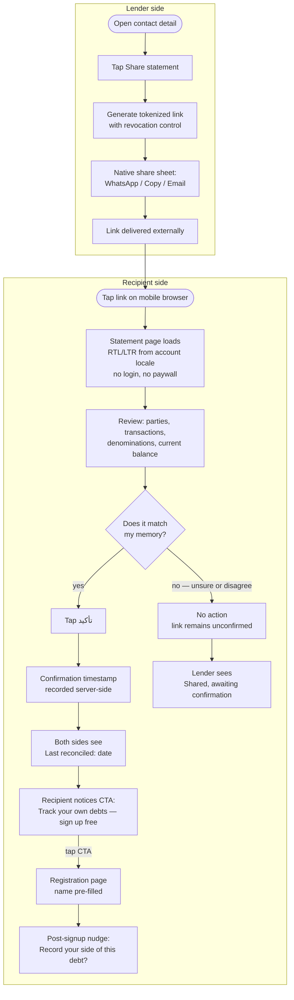
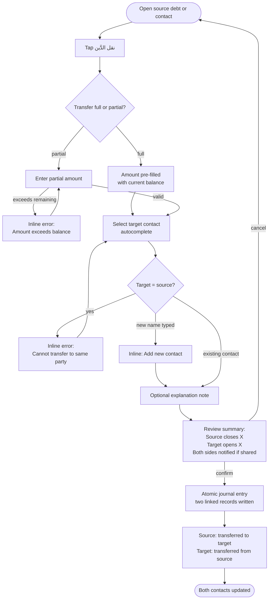
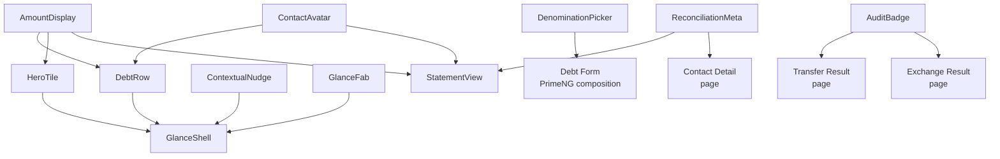

# UX Design Specification Faktuboh

**Author:** Wahid
**Date:** 2026-04-16

---

## Executive Summary

### Project Vision

Faktuboh is a personal debt ledger that replaces scattered spreadsheets, chat messages, and unreliable memory with a single, clear system for tracking who owes what to whom. It supports multiple currencies and precious metals (tracked in grams) natively — a debt recorded in gold grams stays in gold grams, never auto-converted. Users can transfer debts between parties through simple journal entries and share read-only account statement links with contacts who need no account to view them.

The product targets individuals and small businesses globally who lend and borrow regularly — especially in communities where informal lending is culturally embedded and may involve gold or multiple currencies. It launches as a responsive web application (mobile-first) with full bilingual support (Arabic RTL + English LTR) from day one.

The core UX philosophy: **the simplicity of a paper notebook with the power of accounting underneath**. Every design decision serves one question — does this make recording and proving a debt faster and clearer?

### Target Users

**Primary: Individuals who lend and borrow regularly**
People across diverse tech-savviness levels — from digitally fluent professionals to shop owners with limited tech experience. They frequently lend money to friends and family, or borrow from them, often across currencies and sometimes involving gold (family and cultural transactions). They need a way to record debts "in the moment" — standing with the person, phone in hand — but must also support delayed entry when they forget. Their current tools (spreadsheets, chat messages, memory) fail them regularly, leading to forgotten debts, disputes, and strained relationships.

Key insight: These users don't fear buttons — they fear **making mistakes they can't undo**. Simplicity means clarity of intent and safe reversibility, not fewer UI elements.

**Secondary: Small business owners and micro-merchants**
Shop owners and traders who extend informal credit to customers. Their workflow maps directly to the primary persona (record credit, check balance, share statement). A shop owner extending credit to 50 regular customers is replacing a paper ledger. They need the same core experience — no separate feature set required.

**Statement recipients (viral loop targets)**
People who receive shared statement links — their first contact with Faktuboh. They need an instant, trustworthy experience: a clean, professional statement page that loads fast on any device and any network. The tone must convey "transparent record" not "accusation" — this is a culturally sensitive moment where trust is built or destroyed.

**Launch market:** Arabic-speaking communities, with bilingual interface positioning for both Arabic-first and English-speaking users in the region.

### Key Design Challenges

**1. Absolute simplicity for users with diverse tech-savviness**
The product offers powerful features (multi-currency, debt transfers, exchange operations, shareable statements) but must feel as simple as opening a notebook and writing a number. The real barrier isn't complexity of UI — it's the user's fear of making an irreversible mistake. Design must communicate safety: clear undo paths, confirmation before destructive actions, and familiar language ("someone borrowed from me" not "add new debt entry").

**2. "In the moment" debt capture on mobile**
The primary usage moment is standing with someone after a financial transaction — phone in hand, attention split. Debt recording must complete in 2-3 taps with minimal cognitive load. The capture flow is the single most important UX surface — every other design decision follows from it. Optimistic UI (show success instantly, sync in background) is essential for the <500ms target.

**3. Bilingual RTL + LTR from day one**
Not just translated strings — full directional layout, number formatting, and currency display for both Arabic and English. The hardest challenge is mixed-direction content: English numbers inside Arabic sentences, English contact names in Arabic tables, currency codes alongside Arabic text. Direction-neutral components for numbers, currencies, and dates must be designed before any code is written.

**4. Multi-currency balance display without cross-currency aggregation**
Users may owe or be owed in USD, EUR, SAR, and gold grams — all with the same contact. Displaying these clearly without aggregation (a deliberate product decision) risks creating overwhelming lists. The design approach: "pockets" not lists — each denomination gets its own visual card, instantly scannable, clearly separated. No mental math required.

**5. The shared statement page as first impression and trust builder**
The statement link is the product's face to the world and its primary growth engine. This page must: load in under 2 seconds on slow mobile networks (<50KB), look professional and trustworthy, present debt information with a tone of "comfortable transparency" not "confrontation", and include a non-intrusive sign-up CTA. In cultures where debt is sensitive, the emotional design of this page directly determines whether the viral loop works or breaks.

**6. Gold and precious metals as culturally significant denominations**
Gold is not just another currency — in Arabic and South Asian communities, it is the currency of family trust (dowries, gifts, emergency reserves). The UX for gold transactions must respect this cultural weight: clear gram-based tracking, careful exchange operation design, and a visual treatment that acknowledges gold's special status without over-complicating the interface.

### Design Opportunities

**1. Fastest path from "I just lent someone money" to "it's recorded"**
If debt capture takes fewer taps than opening a spreadsheet and finding the right cell, the product wins. The activation moment (record first debt + share link) in under 3 minutes is both the success metric and the product's core promise. First screen after registration should be the debt entry form — "Who borrowed from you? How much?" — no onboarding wizard, no tutorial overlay.

**2. "Proof of debt" as a new social primitive**
The shareable statement link is not a feature — it is a new category of social object. A neutral, timestamped, confirmable record between two parties that replaces awkward conversations. When both parties confirm, it becomes lightweight digital social proof — stronger than a WhatsApp message, lighter than a legal contract. The design must make sharing feel natural and non-threatening — like sending a receipt, not filing a complaint.

**3. "Your financial life at a glance" — the reason to come back daily**
The dashboard that shows all contacts, all denominations, all balances in one view is what spreadsheets can never provide. This is the retention driver — the feeling of "I finally know exactly where I stand." Visual pockets per denomination, clear who-owes-whom direction, and instant access to any contact's full history.

**4. Familiar language over technical terms**
Using culturally familiar phrases ("someone borrowed from me", "I lent to...", "gold from the wedding") instead of accounting jargon ("debit entry", "journal posting") dramatically lowers the barrier for non-technical users. The optional story/context field per transaction transforms a dry ledger into a human financial narrative that builds trust when shared.

## Core User Experience

### Defining Experience

**The core experience is clarity, not capture.**

Faktuboh's defining experience is the moment a user opens the app and instantly sees their complete financial position — who owes them what, what they owe, across all contacts and all denominations, at a glance. This is the experience that replaces the mental fog of scattered spreadsheets and forgotten chat messages. The user opens Faktuboh not primarily to record — but to **know**.

The dashboard is not merely an overview — it is the user's **personal financial command center**. It should evoke the feeling of opening a well-organized notebook where everything is in its place. The emotional response is control and calm, not information overload.

**Interaction model inspiration:** The app's mental model draws loose inspiration from messaging apps familiar to the target audience — a contact list as the primary view, where tapping a contact reveals the full financial conversation (statement). This familiarity reduces the learning curve for users who may struggle with novel interfaces. The inspiration is in structure, not in sort order — statement activity, not chronological messaging, drives the app's behavior.

**Experience hierarchy (in order of importance):**

1. **See the full picture** — Dashboard and account statements that answer "where do I stand?" instantly. This is the primary reason users open the app and the primary reason they come back.
2. **Share proof — the act that transforms a private ledger into a shared social truth** — Sharing a statement is the mechanism that aligns the user's record with the reality of the debt (which exists between two people). Without this act, the product is merely a more organized spreadsheet. The share moment is where Faktuboh becomes *different* from every predecessor. Second in daily frequency but first in product identity.
3. **Record a debt** — Adding a new transaction. This is the input that feeds the system, and it must be fast and frictionless — but it serves the higher goal of maintaining an accurate, complete picture.

**The "aha" moments (in order):**
- **First**: User sees all their balances across all contacts and denominations in one view — "I finally know exactly where I stand."
- **Second**: The counterparty opens the shared link, sees the statement, and taps "Confirm" — "We both agree, no awkward conversation needed."

**The catastrophic failure: Any divergence between the recorded state and what the app displays.**
This includes wrong balances, lost transactions, unsynced writes (where the UI shows success but the server didn't persist), and any display error that misrepresents a stored value. In a system whose entire value is trustworthy memory, any breach of this trust is terminal. Faithful representation of what the user recorded is not a feature — it is the product itself. Note: this is faithfulness to the user's record, not adjudication of disputes between parties — resolving disagreements between the user and a counterparty is a separate concern.

### Platform Strategy

**Responsive web, mobile-first — no offline support in MVP.**

- **Primary device**: Mobile phone browser. Users check their financial position on the go and share statements via messaging apps (WhatsApp, Telegram).
- **Secondary device**: Desktop browser for extended sessions — reviewing history, exporting CSV, admin operations.
- **Touch-first interaction design**: All primary flows (view dashboard, share statement, record debt) optimized for thumb-reachable touch targets (minimum 44x44px).
- **No offline capability in MVP**: The current version requires an internet connection. Offline recording and sync will be explored in the future native mobile app.
- **Shared statement pages**: Lightweight server-rendered pages independent of the SPA — must load fast on any device, any browser, any network speed. These pages are the product's public face.

### Effortless Interactions

**What should feel completely natural and require zero thought:**

**1. Checking balances**
Opening the app and seeing the full financial picture should be instant (<2s). No taps, no navigation, no filters needed for the default view. The dashboard IS the landing page after login.

**Dashboard prioritization logic (measurable):**
- **Top section:** Contacts with activity in the last 7 days OR balance above the user's 75th percentile threshold
- **Middle section:** Contacts with pending confirmations or recent statement shares
- **Bottom section:** Dormant contacts (no activity >30 days), collapsible
- **Search-first at scale:** When the user has >10 contacts, a persistent search bar appears above the list
- **Success metric:** Dashboard must remain usable at 50+ contacts without scrolling past more than 5 items to reach high-priority ones

**2. Sharing a statement**
From any contact view, sharing should be 2 taps maximum: "Share" → copy link or send via messaging app. The system generates the link; the user just sends it.

**Share flow — softened default:**
- A single default share action with welcoming language ("Share statement") — not transactional ("Send bill")
- Pre-filled message template adapted to cultural norms (e.g., "شوف كشف حسابنا مع بعض، تأكد معي من الأرقام")
- Recipient-facing page opens with relational language: "Hi [Name], [Sender] shared a record of your shared transactions" — not "You have an outstanding balance"
- **Advanced option** (secondary, accessible but not prominent): write a custom personal message before sharing — for users who want more control over tone
- No multi-tone picker in MVP — adding more than one choice at this moment adds decision friction that hurts the exact users we want to make comfortable

**3. Recording a debt**
Minimum required fields visible immediately: contact (select or type new name), amount, denomination (smart default to last used), lent/borrowed toggle. Date defaults to today but is editable for delayed entry. Save with one tap. The entire flow should complete in under 30 seconds.

**Repeat transactions:** Users with high-frequency contacts (e.g., shop owners tracking regular customers) can repeat a previous transaction with a single action — pre-filled amount, denomination, and contact from the last entry. Tap, adjust amount if needed, save.

**4. Switching language**
Toggling between Arabic and English should be instant and seamless, with the entire layout flipping direction naturally. The user should never feel "translated" — each language should feel native.

**5. Understanding a statement (as recipient)**
A person who receives a shared link and has never heard of Faktuboh should understand what they're looking at within 5 seconds: who sent it, what the balance is, and what the transaction history shows. Zero learning curve.

**What should happen automatically:**
- Balance recalculation on every transaction — always accurate, always current
- Statement link generation with cryptographically secure tokens — no user configuration needed
- Date and time stamping of every transaction and confirmation
- Currency/denomination detection based on user's recent activity (smart defaults)
- Story/context field serves dual purpose: enriches shared statements for recipients AND acts as the user's own memory aid — searchable tags that help locate specific transactions months later ("the gold from the wedding", "laptop loan")

**Optimistic UI — scope and limits:**
Optimistic UI is permitted for **read operations** (dashboard rendering, statement viewing, navigation). For **write operations** (recording a debt, transfer, exchange), the user must see explicit confirmation that the data is durably persisted before a "saved" state is shown. Performance targets are met through efficient server round-trips and pre-fetching — not by faking success. Trust over speed. A user who briefly sees "saving…" then "saved" trusts the system more than one who sees "saved!" and later discovers it wasn't.

### Critical Success Moments

**Moment 0: "This looks legit" (Pre-acquisition — statement recipient)**
Before any user signs up, a statement recipient sees Faktuboh for the first time through a shared link. Within 5 seconds, they must conclude: "This is a real, trustworthy record." This moment precedes all other success moments chronologically — it is the entry point to the entire user funnel. Design the statement page as if it were the homepage.
- **Enabled by:** Lightweight standalone page (<50KB) loading in under 3 seconds on slow networks; sender identity prominently displayed (sender's name, optional profile photo, "Member since [date]"); Faktuboh logo and a one-sentence "What is Faktuboh?" explanation at the top; clear verification cues (HTTPS, domain visible, "Cryptographically unique — cannot be forged"); contextual reassurance ("This is not a bill, not a legal demand, not a payment request — it's a shared record for your review"); visual language matching trusted messaging apps (clean, white space, familiar iconography), not formal banking apps; sign-up CTA visible but not dominant, appearing after the statement is understood.

**Moment 1: "I can see everything" (Activation — first session)**
The user registers, records their first debt, and for the first time sees a clean dashboard showing that contact's balance. Even with just one entry, the user glimpses what the full picture will look like. The activation target: this happens within 3 minutes of registration.
- **Enabled by:** Dashboard as the default landing page (zero-tap access); no onboarding wizard — first screen after registration is the debt entry form; familiar language in the form ("who borrowed from you?" not "add debit entry").

**Moment 2: "We both agree" (Trust — first share)**
The user shares a statement link. The counterparty opens it, sees a clear and professional record, and taps "Confirm." The user sees the confirmation date on their dashboard. For the first time, both sides have a shared source of truth without an awkward conversation.
- **Enabled by:** Two-tap share from any contact view; softened default share message; relational (not transactional) language on the recipient page; visible confirmation date feedback on the sender's dashboard.

**Moment 3: "I'm in control" (Retention — ongoing use)**
After weeks of use, the user has multiple contacts with debts across currencies and gold. They open the dashboard and see everything — every contact, every denomination, every balance. They can drill into any contact, filter by date, share any statement. The feeling: "I finally have control over my financial relationships."
- **Enabled by:** Intelligent dashboard prioritization keeping high-relevance contacts visible; per-denomination "pockets" preventing list overwhelm; instant drill-down to any contact's full history; date-range filters with previous-balance rollup.

**Moment 3b: "Something needs my attention" (Active notification)**
Beyond passive dashboard viewing, users need clear visual signals when something requires action — a counterparty confirmed a statement, a payment date passed, or an unexpected change occurred. A subtle notification badge on relevant contacts mirrors familiar messaging app patterns without importing the messaging sort order.
- **Enabled by:** Badge counts on the contact row for unread confirmations or new events; a single unified "what's new" entry point on the dashboard; real-time updates via the app's push connection.

**Moment 4: "That was easy" (Delight — complex operation)**
The user performs a debt transfer or currency exchange — operations that would be nightmarish in a spreadsheet. In Faktuboh, it takes a few taps, the audit trail is automatic, and both contacts' balances update correctly. Complex accounting, simple experience.
- **Enabled by:** Guided flows that hide accounting complexity (journal entry details, rate-locking) behind plain-language steps ("transfer this debt to another contact", "settle in a different currency"); automatic audit trail generation; visible confirmation of both-sided effect.

**Make-or-break flows:**
- Dashboard load and accuracy — if the balance is wrong or slow, trust is gone
- Statement link rendering for recipients — if it's slow, confusing, or feels threatening, the viral loop breaks
- First debt recording — if it takes more than 3 minutes or feels complicated, the user returns to their spreadsheet

### Experience Principles

**Principle 1: Clarity is the product**
The primary value is not recording debts — it is seeing the truth. Every screen, every interaction must prioritize clarity of financial position. If a design choice makes the interface prettier but the balances harder to read, reject it.

**Principle 2: Zero hesitation for daily actions**
The user should never pause to think "what do I tap next?" for primary flows. Viewing balances: instant (home screen). Sharing a statement: an obvious path from any contact. Recording a debt: a single, clear entry point always visible. Measure success by user hesitation, not tap count — two taps with hesitation is worse than four taps without.

**Principle 3: Comfortable transparency, not confrontation**
Every shared artifact (statement links, confirmation requests) must feel like a friendly receipt — neutral, clear, professional. Never accusatory, never pressuring. The language, visual design, and tone must make financial transparency feel safe and natural for both parties.

**Principle 4: Faithful representation of what the user recorded**
A record that silently diverges from what the user entered is the only unrecoverable failure. Every balance shown must match what is durably persisted. Every edit must be auditable. When the user's view and the database state could diverge (network failures, concurrent edits, sync errors), the UI must communicate uncertainty honestly rather than hide it. Transparency about state is itself a UX feature. Note: this principle is about the app being faithful to what the user recorded — not about adjudicating whether the user's record matches the counterparty's memory.

### Open Questions

These items surfaced during UX discovery but require product-level decisions beyond UX design:

- **Statement disagreement mechanism:** The current PRD provides only a "Confirm" action on shared statements. Recipients may want to flag specific disagreements rather than silently rejecting (not tapping Confirm). This is a potential feature gap worth discussing — a "this doesn't match" affordance without opening a messaging channel. Flagged for product discussion.

## Desired Emotional Response

### Primary Emotional Goals

**Primary emotion:** Trust. Every design decision must reinforce the user's confidence that the numbers are accurate and the app is reliable.

**Background emotion (95% of the user relationship):** Peace of mind from mental offload. The user does not think about the app when it is closed, but is confident that everything is safely recorded. The app works quietly in the background of their life.

**Signature emotional hook (the "why users tell friends"):** *"Since I started using it, I don't forget my debts and dues anymore."* This is a relief statement, not a delight statement — the app removes cognitive burden rather than adding enjoyment.

**Emotions to avoid at all costs:**
- Anxiety about whether numbers are correct
- Distrust of the app's reliability or sync state
- Overwhelm from too many features or decorative UI elements

### Emotional Journey Mapping

| Moment | Desired Feeling | Rationale |
|---|---|---|
| First app open | Reassurance — "this is clear and manageable" | No overwhelming onboarding; user sees the dashboard immediately |
| Recording first debt | Ordinary — "just done" | No celebration; recording is a routine utility action |
| Opening app daily | Ambient trust — "everything is where I left it" | Stable visual state; consistent balances |
| Sharing a statement | Neutral, professional — "this is just sharing facts" | No exaggerated friendliness or emotional framing |
| Recipient opens shared link | Mutual respect — "I am being shown information, not accused" | Dignified framing; neutral language for both parties |
| Something fails (sync, network, etc.) | "It's a small problem, it will resolve" | Calm error tone, not alarm |
| Closing the app | Cognitive relief — "it's all safely recorded" | Background confidence persists beyond the session |

### Micro-Emotions

Of the six micro-emotion pairs considered, three are decisive for Faktuboh:

- **Confidence over skepticism** — users must trust balances without double-checking. Design must avoid anything that undermines numeric authority: no animated counters, no placeholder dashes, no "approximate" framings.
- **Silent efficiency over celebration** — completing a task should feel like closing a drawer, not winning a prize. No confetti, no streaks, no achievements, no sound effects on save.
- **Mutual respect over isolation** — the shared-statement experience must treat both parties with equal dignity. Language must be neutral ("transactions recorded by [name]") rather than adversarial ("[name] says you owe...").

The other three pairs (trust/skepticism, excitement/anxiety, delight/satisfaction) are resolved by the principles above — trust is the primary goal, anxiety is the primary thing to prevent, and satisfaction is preferred over delight.

### Design Implications

Emotional goals translate directly to non-negotiable design rules:

| Emotional Goal | Design Implication |
|---|---|
| Trust in numbers | Stable typography; no animated counters; neutral color for digits; fixed decimal places per currency |
| Ambient trust | Visible "last synced" state that is present but not noisy; no alarming "data may be lost" messaging ever |
| Quiet onboarding | No welcome modals; no forced tours; dashboard is visible on first open with one subtle hint |
| Minimal completion feedback | Save confirmation is a 1-second toast with optional haptic — no sound, no animation, no celebration |
| Dignified sharing | Default share message is polite and matter-of-fact, no emojis; recipient view uses neutral language |
| Calm error tone | Muted yellow/orange for problems (not alarm red); conversational microcopy; solution presented alongside problem |
| Silent efficiency | No streaks, no achievements, no badges; fastest possible path from intent to completion |
| Language-neutral framing | All text referring to counterparties uses factual descriptors, never accusatory phrasing |

### Emotional Design Principles

**Principle 1: Stability signals trust.**
Visual stillness, predictable layouts, and unchanging typography are emotional choices, not aesthetic ones. Motion is reserved for navigation, never for numbers.

**Principle 2: Quiet utility beats loud delight.**
Faktuboh is the tool the user reaches for without thinking — it should feel like a well-worn notebook, not a game. Celebration is the absence of friction, not the presence of animation.

**Principle 3: Ambient reassurance over foreground announcement.**
The user's peace of mind comes from knowing the app is reliable even when closed. Trust signals belong in the background, not in pop-ups.

**Principle 4: Neutral language serves both parties.**
Because financial relationships are socially delicate, the app must never take the owner's side in tone — even though it belongs to the owner. Fairness of framing preserves the dignity of sharing.

**Principle 5: Small problems stay small.**
When errors occur, tone communicates "this is manageable" before any words do. Color, copy, and iconography all cooperate to keep minor issues from feeling catastrophic.

## UX Pattern Analysis & Inspiration

### Inspiring Products Analysis

Seven products were selected as references, each chosen to teach a specific pattern that serves a specific principle from the Emotional Design framework. Selection was filtered to exclude products that violate the "quiet utility" positioning — gamified finance apps, celebration-heavy trackers, and feature-bloated platforms were excluded on principle, not for lack of polish.

#### Tier A — Direct Domain References

**Splitwise** — The closest functional competitor.
- *What it teaches:* Net balance display (who owes whom, by how much, without intermediate numbers); settle-up flow that clears balances with a single action; per-transaction currency support within a shared group.
- *What to reject:* Group-centric model (Faktuboh is individual-first); UI density accumulated through feature creep; opinionated categorization.
- *Primary value:* Provides a proven model for "settle up" mechanics and net-balance summarization — both are direct requirements for Faktuboh.

**Wise (formerly TransferWise)** — The benchmark for trust in multi-currency UX.
- *What it teaches:* Each currency held in a visibly distinct wallet with no hidden conversion; transparent fee and exchange-rate display in calm tone; "last updated" indicators that convey freshness without anxiety; typography where digits do not animate, shift, or fluctuate.
- *Primary value:* Sets the visual grammar for Faktuboh's multi-currency and gold-in-grams requirements — denomination integrity is not a feature Wise added, it is the organizing principle of their product.

#### Tier B — Quiet Utility Benchmarks

**Apple Wallet** — The embodiment of trustworthy quiet utility.
- *What it teaches:* Card-stack metaphor where each entity gets a distinct visual card; success states communicated with a minimal checkmark and haptic, never confetti or sound; visual permanence — cards do not rearrange themselves unexpectedly.
- *Primary value:* A model for representing each counterparty (person or business) as a card in Faktuboh, with all their state surfaced on that card.

**Apple Notes** — Zero celebration, universal familiarity, search-first access.
- *What it teaches:* Auto-save that is invisible (no "saved!" messaging); search as the primary discovery tool (rather than requiring the user to organize); no opinion imposed on content — no categorization pressure, no gamification, no suggestions.
- *Primary value:* Establishes the "quiet save" pattern for transaction entry. Users should be able to enter a debt and move on, without being asked to categorize, tag, or confirm.

#### Tier C — Arabic-First / Regional References

**WhatsApp** — The de-facto UX grammar for Arabic-speaking users.
- *What it teaches:* Contact-list pattern showing counterparty name, summary snippet, and timestamp at a glance; share-link generation, copy, and external distribution mechanics; status signals (the well-known ticks) for message delivery; reliable RTL/LTR handling with Latin numbers inside Arabic text.
- *What to reject:* Chat-based interaction model — Faktuboh should not invite message-style exchange between parties; only borrow the visual grammar.
- *Primary value:* Reduces learning curve dramatically. 90%+ of target users open WhatsApp daily — any pattern borrowed from it feels immediately native.

**Regional Fintech (STC Pay / Careem Pay / Mada reference apps)** — Money UX calibrated for Arabic-speaking users.
- *What it teaches:* The convention of Arabic interface text with Latin numerals (e.g., "الرصيد 1,250.00 ريال" rather than "الرصيد ١٬٢٥٠٫٠٠ ريال") — this is a regional UX standard, not an oversight; transaction history layout that has proven readability in the region; culturally fluent microcopy like "تم" instead of "Done".
- *Primary value:* Confirms the numeral-rendering convention and provides a validated pattern library for bilingual financial screens.

#### Tier D — Web/Desktop Utility References

**Linear** — Quiet utility translated to the web.
- *What it teaches:* Keyboard-first interaction for power users; a command palette (Cmd/Ctrl+K) as a universal access layer for common operations; onboarding that is invisible — the product is usable on first load with contextual hints rather than forced tutorials; animation reserved strictly for navigation between views, never for data.
- *Primary value:* Since Faktuboh launches as responsive web, Linear is the reference for how a web utility can feel fast and serious simultaneously.

### Transferable UX Patterns

Patterns are grouped by application area and mapped to specific Faktuboh features. Each pattern has a decision: **Adopt** (use as-is), **Adapt** (use with modification), or **Avoid** (do not use).

#### Navigation & Information Architecture

| Pattern | Source | Decision | Application in Faktuboh |
|---|---|---|---|
| Contact list as entry point | WhatsApp | Adopt | Parties list is the primary home screen; each party shows name, net balance, last transaction date |
| Card-stack for entities | Apple Wallet | Adapt | Each counterparty rendered as a card in the list; tapping reveals full statement |
| Search as primary discovery | Apple Notes | Adopt | Global search across parties, transactions, notes, and tags — accessible from every screen |
| Command palette (Cmd/Ctrl+K) | Linear | Adopt (web only) | Power-user shortcut for actions: "new debt", "jump to party", "share statement" |

#### Transaction & Balance Display

| Pattern | Source | Decision | Application in Faktuboh |
|---|---|---|---|
| Net balance per party | Splitwise | Adopt | "Party owes you X" or "You owe party X" shown as the primary number on each card |
| Multi-currency wallet view | Wise | Adopt | Each currency/denomination (USD, SAR, Gold grams, etc.) shown as a separate line per party — never auto-converted |
| Stable digit typography | Wise / iOS Calculator | Adopt | Digits in fixed-width alignment, fixed decimals per currency, no animation on value changes |
| Transaction-history row layout | Regional fintech | Adapt | Date + amount + counterparty + optional note in a scannable row; localized date formatting |

#### Trust Signals & System State

| Pattern | Source | Decision | Application in Faktuboh |
|---|---|---|---|
| Invisible auto-save | Apple Notes | Adopt | No "saved!" modals; a subtle toast confirming the transaction exists |
| "Last synced" indicator | Wise | Adopt | Quiet timestamp showing freshness without alarm language |
| Delivery-status ticks | WhatsApp | Adapt | For shared statements: borrow the signal concept (sent → opened → confirmed) in a non-chat context |
| Success haptic + micro-checkmark | Apple Wallet | Adopt | Transaction save produces a brief haptic and a small checkmark, nothing more |

#### Sharing & External Flows

| Pattern | Source | Decision | Application in Faktuboh |
|---|---|---|---|
| Share-link generation and copy | WhatsApp | Adopt | One-tap generation of a statement link, ready to paste into any messaging app |
| Neutral recipient framing | Wise | Adapt | Recipient sees "Transactions recorded by [name]" rather than "[name] says you owe" |

#### Bilingual & Localization

| Pattern | Source | Decision | Application in Faktuboh |
|---|---|---|---|
| Arabic UI + Latin numerals | Regional fintech | Adopt | Default convention unless the user explicitly prefers Arabic-Indic numerals |
| Instant language switch | WhatsApp | Adopt | Language toggle available at any time without losing context |
| RTL/LTR text mixing | WhatsApp | Adopt | Robust handling of mixed scripts in notes fields and party names |

### Anti-Patterns to Avoid

The following patterns are explicitly rejected because they conflict with the Emotional Design principles. This is not a taste decision — each one actively undermines a specific principle.

#### From Gamified Finance Apps (e.g., Duolingo-style habit products, Revolut gamification)

- **Streaks** — Recording debts should never become a maintenance task. A streak creates the feeling "I must log something to preserve my streak," which is the opposite of mental offload.
- **Leaderboards or social comparison** — Debt is socially sensitive; competition is inappropriate.
- **Achievement badges** — Celebrating "first debt recorded" treats a routine utility action as a milestone.
- **Confetti, celebratory animations, sound effects** — All violate "silent efficiency."
- **Mascot-led tutorials** — Break the serious, trustworthy tone of a financial tool.
- **Urgency-driven push notifications** ("You haven't logged today!") — Violate the user's background peace-of-mind.

#### From Feature-Bloated Finance Apps (e.g., Revolut-style super-apps, full-featured banking apps)

- **Dashboards with many KPIs at once** — Violate the "dashboard prioritization" rule established in Core Experience; overwhelm the user with undifferentiated information.
- **Embedded cross-sell of unrelated products** (insurance, crypto, trading) — Break trust; make the app feel like a sales channel rather than a utility.
- **Trendy animated backgrounds and gradients** — Violate "stability signals trust."
- **Forced session timeouts without clear reason** — Feel paternalistic; break ambient trust.

#### From Rigid Budgeting Apps (e.g., YNAB-style full budgeting, Mint-style categorization)

- **Mandatory categorization of transactions** — Faktuboh tracks relationships, not categories; imposing categories adds friction with no value.
- **Long mandatory onboarding flows** — Users want to record a debt immediately; gated onboarding contradicts reassurance on first open.
- **Envelope or budget-based mental models** — Wrong model for debt tracking between parties.

#### From Poorly Localized Apps

- **Mirrored icons in RTL where they should not mirror** (e.g., clock icons, play buttons, chart directions) — Violates polish and trust.
- **Inconsistent numeral rendering** (Arabic-Indic numerals in one screen, Latin in another) — Undermines numeric authority.
- **Translated strings that break the line due to length differences** — Visual instability; signals carelessness.

#### From Chat-First Tools

- **Messaging interface between parties** — Faktuboh is a ledger, not a chat app. Borrow the visual grammar of messaging, but not the interaction model.
- **Real-time typing indicators, read receipts on personal messages** — Not applicable; creates social pressure.

### Design Inspiration Strategy

The inspiration plan for Faktuboh is expressed as three explicit commitments:

#### What to Adopt Directly

These patterns are ready to use without modification because they already align with the principles:

- **Invisible auto-save with minimal confirmation** (Apple Notes pattern) — supports Quiet Utility and Ambient Reassurance.
- **Stable, non-animating digit typography** (Wise + iOS Calculator pattern) — supports Stability Signals Trust.
- **Contact-list as home screen** (WhatsApp pattern) — supports cultural familiarity and low learning curve.
- **Multi-currency wallet integrity** (Wise pattern) — directly implements the denomination-integrity decision from the product brief.
- **Search as primary navigation** (Apple Notes pattern) — supports Quiet Utility; users find what they need without hierarchy learning.
- **Arabic UI + Latin numerals convention** (Regional fintech pattern) — the regionally validated standard.

#### What to Adapt With Modification

These patterns are useful but need modification to fit Faktuboh's specific context:

- **Settle-up mechanic** (Splitwise) — adapt from group-centric to pair-centric; one action clears a specific balance between the owner and one counterparty, not across a group.
- **Card-stack metaphor** (Apple Wallet) — adapt from payment cards to relationship cards; each card represents a person or business with their full state visible.
- **Delivery-status signals** (WhatsApp ticks) — adapt from chat messages to shared-statement lifecycle (sent → opened → confirmed), in a non-chat context.
- **Share-link external distribution** (WhatsApp) — adapt with neutral framing at the recipient end; the link opens a dignified statement view, not a chat.
- **Transaction-history row layout** (Regional fintech) — adapt to include counterparty name prominently (since this is the organizing entity), and localized date/numeral formatting.
- **Command palette** (Linear) — adapt as an optional power-user feature on web; never required, never surfaced in mobile.

#### What to Avoid With Explicit Intention

These rejections are design commitments, documented so they are not reconsidered casually later:

- **No streaks, achievements, badges, or gamification of any kind** — violates Quiet Utility.
- **No celebratory animations or sounds** on success — violates Silent Efficiency.
- **No mandatory categorization of transactions** — imposes friction without aligning with the user's mental model.
- **No long onboarding flows** — user sees the dashboard on first open; hints are contextual, not sequential.
- **No cross-sell, embedded ads, or unrelated product promotion** — breaks Ambient Trust.
- **No chat-style messaging between parties** — the app is a ledger, not a communication channel.
- **No mixed numeral rendering within the same screen** — undermines numeric authority.
- **No animated counters on balance changes** — violates Stability Signals Trust.

This strategy forms an explicit decision record: any future UX proposal can be checked against this list before implementation.

## Design System Foundation

### 1.1 Design System Choice

**Primary system:** PrimeNG v21 (aligned with Angular 21) as the component library foundation.

**Supporting tooling:**
- **@primeng/mcp server** for Claude Code integration — provides live, authoritative component documentation during AI-assisted development, significantly raising code-generation accuracy and reducing hallucinated API usage.
- **Lightweight PrimeNG skill** — a project-level set of conventions and examples that codify how Faktuboh uses PrimeNG (theme tokens, allowed components, motion discipline, RTL rules).
- **Tailwind CSS** — used strictly for **layout only** (grid, flex, spacing, responsive breakpoints). Not used for component styling. This separation keeps PrimeNG theme tokens as the single source of visual truth.
- **AG Grid** — held in reserve for future "heavy grid" scenarios (virtual scrolling at scale, advanced filtering, frozen columns, pivoting). Not used in MVP; introduced only when PrimeNG's DataTable reaches its operational ceiling.

### Rationale for Selection

The choice is grounded in four factors that aligned decisively:

**1. Framework alignment.**
PrimeNG v21 tracks Angular 21's release cadence. Using matching major versions avoids the compatibility friction that plagues projects pairing Angular with design systems that lag the framework.

**2. AI-assisted development leverage.**
The @primeng/mcp server is the decisive factor for a small team. With it, Claude Code can query the exact API of the PrimeNG v21 component being used, rather than relying on stale training data. This compounds velocity on every component interaction.

**3. Feature coverage without premature custom engineering.**
PrimeNG ships DataTable, Calendar, AutoComplete, Dialog, Toast, Chart, Tree, and ~80 other components out of the box. For a financial ledger that needs statements, party pickers, date handling, and confirmations, this is near-complete coverage from day one. Building equivalent components in a headless approach would delay MVP by weeks with no user-visible benefit.

**4. Strong RTL support.**
PrimeNG has mature, production-tested RTL handling — a hard requirement for Faktuboh's Arabic-first positioning. Custom or less-mature systems would require building RTL support as a project concern rather than inheriting it.

**Trade-off accepted:** PrimeNG's default aesthetic is generic enterprise. A dedicated theming investment is required to reach the "quiet utility" visual language defined in the Emotional Design principles. This is a known cost, paid once, captured below.

### Implementation Approach

**Theme foundation:** Start from PrimeNG's **Aura** theme preset, which exposes a modern token system (design tokens via CSS variables). Aura is chosen over Lara because its token architecture is cleaner and more amenable to custom preset generation.

**Custom preset — "Faktuboh Quiet":** A derived preset that overrides Aura's tokens to match the Emotional Design principles:
- **Color:** Muted neutrals for numeric content (digit color is a near-black grey, not pure black); primary accent is a calm blue, never saturated; error state is muted amber, not alarm red; success state is quiet green, used sparingly.
- **Typography:** Numeric values use a tabular-numeral font (e.g., Inter with `font-variant-numeric: tabular-nums`); font-weight remains stable across states to prevent visual jitter; numeric line-height fixed so rows align perfectly in tables.
- **Motion:** Transition durations reduced; component ripples disabled globally; no celebratory micro-interactions.
- **Elevation:** Minimal shadow usage; depth communicated through borders and background tone shifts rather than heavy drop shadows.
- **Radius:** Moderate border radius (6–8px) — not sharp enterprise, not bouncy consumer.

**Layout system:** Tailwind CSS configured with the `tailwindcss-rtl` approach (logical properties `ms-*`, `me-*`, `ps-*`, `pe-*`) to handle RTL and LTR in a single codebase. Tailwind's role is strictly:
- Page-level layout (grid, flex containers)
- Spacing between components
- Responsive breakpoints
- Typography utilities on non-PrimeNG content (plain text blocks)

Tailwind is explicitly **not** used to restyle PrimeNG components — all component-level visual decisions go through PrimeNG theme tokens.

**AI-assisted development setup:**
- `@primeng/mcp` configured in the repo's MCP server list so Claude Code queries PrimeNG v21 docs live.
- A project-level **PrimeNG skill** (file-based) documents:
  - The allowed subset of PrimeNG components for Faktuboh (whitelist, not blacklist)
  - Component-level conventions (e.g., always pass `aria-label` for icon-only buttons)
  - Theme token usage rules (never hardcode colors; always reference CSS variable)
  - Motion discipline (no `[@animation]` bindings outside of route transitions)

### Customization Strategy

**Whitelist of MVP components.** Not every PrimeNG component will be used. The following subset covers all MVP requirements; anything outside this list requires justification:

| Use Case | PrimeNG Component | Notes |
|---|---|---|
| Navigation (sidebar/topbar) | `Menubar`, `Sidebar` | Minimal theming; no expanding animations |
| Party list (home screen) | Custom card list using `Card` + Tailwind flex | Not a PrimeNG list component — cards feel warmer |
| Transaction history | `DataTable` (basic mode, no pivoting) | Tabular numerals; alternating row tint; no striping animation |
| New transaction entry | `Dialog` + form controls | `InputNumber`, `AutoComplete`, `Calendar`, `Dropdown` |
| Party picker | `AutoComplete` | Freeform + suggestion; RTL-tested |
| Date entry | `Calendar` | Localized (Hijri support later, Gregorian MVP) |
| Amount entry | `InputNumber` | Currency-aware, grouping-separator per locale |
| Currency selector | `Dropdown` or `Select` | Flat list — no grouping UI |
| Success confirmation | `Toast` (single-line, 1-second) | No sound, no icon animation |
| Destructive confirmation | `ConfirmDialog` | Rarely used; only for delete |
| Language switcher | `SelectButton` (two options) | Persistent in header |
| Loading states | `Skeleton` | No spinners; skeletons communicate structure |

**Components explicitly avoided:**
- `Galleria`, `Carousel`, `Timeline` (too motion-rich)
- `Rating`, `Knob` (gamification-adjacent)
- `Steps` wizard UI (long onboarding anti-pattern)

**`Chart` — scoped use only:** PrimeNG `Chart` is permitted exclusively for the FR32 (debt distribution across contacts — bar) and FR33 (debt distribution across denominations — pie) dashboard charts. Decorative or celebratory chart usage elsewhere remains forbidden. Visual treatment must follow the "Quiet chart envelope" defined in *Direction 6 Implementation Approach → Quiet chart envelope (FR32/FR33)*.

**Token override pattern.** All custom visuals go through PrimeNG's theme preset system, never via `::ng-deep` or style overrides in components. This is enforced by lint rule.

**AG Grid activation criteria.** AG Grid is introduced only if one or more of the following conditions is met:
- Transaction history exceeds practical rendering in `DataTable` (typically > ~5,000 rows per view)
- User feedback demands column pinning, pivoting, or advanced filtering not supported by DataTable
- Statement export requires server-side data fetching with virtualization

Until then, PrimeNG `DataTable` is the only grid component.

**RTL validation.** Every new screen is tested in both LTR and RTL modes before merge. A visual regression suite (screenshots per direction) is established as part of CI.

**Figma kit alignment.** PrimeNG publishes an official Figma kit that mirrors its components. Faktuboh's Figma file uses this kit as the source, with overrides for the Quiet preset. This keeps design and implementation reconciled.

## Defining Interaction Specification

### 2.1 Defining Experience — "The Glance"

**Human promise:** "We remember, so you don't have to." The Glance is the daily proof of that promise.

**Engineering definition:** The defining experience of Faktuboh is **"The 2-second glance"** — the user opens the app and, within two seconds of the home screen becoming visible, understands their complete financial position: who owes them, what they owe, and what is currently most important.

This is intentionally not the most common framing for a ledger product. Most bookkeeping apps frame the defining experience around **data entry** (making recording fast and easy). Faktuboh deliberately inverts this: recording is a tax paid once per transaction, but retrieval happens continuously and must be effortless. The user's ranking of priorities (viewing first, sharing second, recording third) validates this choice.

If we perfect this one interaction, every other feature becomes an input or output of it:
- Recording exists to feed The Glance.
- Sharing exists to let another party experience their own version of The Glance.
- Party detail views exist to deepen The Glance when a single number is not enough.

### 2.2 User Mental Model

Users do not think in transactions. They think in **relationships**:

- "How much does Ahmed owe me?" — not "What's the sum of transactions 1–47?"
- "What is my position with the shop owner?" — not "What's my balance across all USD receivables?"
- "Who still hasn't paid?" — not "Which accounts receivable are overdue?"

Implications:
- The organizing unit of the home screen is **the counterparty**, not the transaction.
- The primary number per relationship is the **net balance** in the original denomination — not a total, not a converted figure.
- The memory the user offloads to the app is relational: "I lent Ahmed 500 riyals last Ramadan." They do not remember the date precisely, but they remember the relationship, the amount, and the context.

**How users currently solve this** (and what fails):
- **Mental memory**: fails after a few weeks; leads to forgotten debts and strained relationships (the catastrophic experience in the user's own words: "I used to forget").
- **Chat-message history**: reliable-seeming but impossible to aggregate; searching "did Ahmed pay the 500?" requires scrolling through months.
- **Spreadsheets**: accurate but not available at the moment of conversation; entry is painful on mobile; no mental mapping to the human relationship.
- **Paper notebooks**: culturally familiar and durable, but not searchable, not shareable, not resistant to loss.

Faktuboh's mental model is the digital extension of the paper notebook — with search, sharing, and persistence added, and nothing else.

### 2.3 Success Criteria

The Glance is successful when all of the following are true on first load after auth. Each engineering contract has an equivalent human phrasing — this is not decoration, it is the phrasing used in user testing to validate whether the contract is being met experientially, not just technically.

| Engineering Contract | Measurable Target | Human Phrasing (user-testing language) |
|---|---|---|
| Time-to-Recognition (TTR) | < 2 seconds perceived | "I knew immediately" |
| Time-to-Interactive | < 500 ms on broadband, < 1.5 s on 3G | "It was just there" |
| Loading spinners visible during home screen render | Zero (skeletons only) | "Nothing made me wait" |
| Taps required to see top-priority balance | Zero | "I didn't have to do anything" |
| Scrolls required to see top-priority balance | Zero | "The important one was right there" |
| Animations on load | Zero | "Nothing was trying to impress me" |
| Cumulative Layout Shift (CLS) | < 0.05 | "Nothing jumped around" |
| Net balance correctness | 100% — zero tolerance | "The numbers were right — I didn't have to double-check" |

These are not aspirational goals; they are the **engineering contract** for The Glance. A failure on any of these compromises the defining experience.

**Qualitative success:** The user closes the app and says nothing — no reaction. The Glance is successful when it is unremarkable. Reactions ("wow!", "neat!") would indicate the app is drawing attention to itself, which violates Quiet Utility.

### 2.4 Novel vs. Established Patterns

**The Glance is an established pattern applied with discipline, not a novel invention.**

The component pattern — a scrollable list of cards, each representing a counterparty with a net balance — is standard. It exists in WhatsApp (contacts with last message), banking apps (account list with balances), and Splitwise (group members with net positions).

What makes Faktuboh's version distinctive is **what it refuses to do**:

| Common "enhancement" in similar apps | Faktuboh's choice |
|---|---|
| Show aggregate net worth at the top | **No** — aggregating across currencies would violate denomination integrity |
| Offer configurable widgets or dashboards | **No** — configuration is friction; the app decides priority automatically |
| Animate numbers on entry | **No** — violates Stability Signals Trust |
| Badge counts, unread indicators | **No** — creates unnecessary urgency |
| "Financial health" score or rating | **No** — debt is not a judgment metric |
| Filters and sort options as primary controls | **No** — default sort is automatic (see Core Experience § Dashboard Prioritization Rules) |

**The user education required is minimal.** Users already understand "list of contacts with a number next to each name" from WhatsApp. The innovation is in what is subtracted, not added.

### 2.5 Experience Mechanics — The Glance, step by step

**Phase 1: Initiation**
- Trigger: user opens the app (tapping the icon, or clicking the web bookmark, or being routed after auth).
- No additional action is required. The Glance begins the moment the home screen paints.

**Phase 2: Interaction**
- The user **does nothing**. Faktuboh does the work.
- The home screen renders a single vertical list of counterparty cards.
- Cards are pre-sorted by the automatic prioritization rules defined in Core Experience (outstanding positive balances first, then outstanding negative, then recent-activity parties with zero balance).
- Each card shows: counterparty name, net balance per denomination (on multiple lines if multi-currency), last transaction date.
- A subtle visual affordance distinguishes priority tiers — a faint left border tint or background-tone shift separates "outstanding" from "recent-activity-only" from "zero-balance" cards. No text labels; the visual tier communicates priority silently.
- Skeleton loaders are used if the list is fetched asynchronously. There is no spinner, ever.

**Phase 3: Feedback**
- The priority ordering *is* the feedback. The top of the list is what matters most, by construction.
- No "you have N outstanding debts!" headline exists. The count would be either anxiety-inducing or redundant.
- If all balances are zero, a quiet single-line empty state appears: "No active balances." No illustration, no call to action.

**Phase 4: Completion**
- The user has three possible next states:
  1. **Completion by understanding**: they have seen what they needed; they close the app. This is the most common case — The Glance completed in under 2 seconds, end of session.
  2. **Drill-down**: they tap a specific card to see the full statement for that relationship. This is secondary navigation, not part of The Glance itself.
  3. **Action**: they initiate recording, sharing, or settling — which are separate flows that feed back into The Glance.

**Invariants across all phases:**
- No loading spinners are ever shown during The Glance.
- No numbers animate into place.
- No modal dialogs or banners interrupt the view.
- Layout is stable between loads; the position of a party in the list only changes when the underlying priority genuinely changes, never due to cosmetic sorting.
- Identical home screen state across sessions until new data arrives — the app does not "re-greet" the user.

**Failure mode to prevent:** stale data shown as fresh. If the last sync failed, a quiet amber timestamp at the top — "Last updated 2 hours ago" — replaces the usual "Just synced". The Glance does not lie about its freshness.

### 2.6 The Glance Maturity Model

The Glance does not emerge fully-formed on first use. It evolves across three lifecycle stages, and the UX must support each stage honestly — never pretending the user has data they don't have, never treating the empty state as a bug.

| Stage | When | State of The Glance | Primary Function |
|---|---|---|---|
| **Stage 0 — Invitation** | Session 1 (first open post-signup) | Empty list; one quiet single-line prompt: "Start by recording your first transaction." | **Invite, don't overwhelm.** No illustrations, no tutorial modal, no walkthrough. A single entry point button. The Glance here is a promise of what the app will become — not a demonstration. |
| **Stage 1 — Confirmation** | Sessions 2–10 (first week) | 1–5 counterparty cards; partial list | **Confirm, don't populate.** When the user opens, they see exactly what they recorded — a kind of digital receipt of their own recent actions. Trust is earned here: what I entered is what I see. If this stage fails, the user abandons. |
| **Stage 2 — Retrieval** | Session 10+ (after sustained use) | 10+ cards; full priority ordering active | **Retrieve, don't remind.** The Glance as defined — the 2-second read of a rich relational graph. Prioritization rules fully engaged. This is where the defining experience lives permanently. |

**Design implications:**
- The UI **does not change structure** between stages. An empty list and a 100-item list use the same layout. The only difference is content density. This builds trust in the permanence of the app's mental model.
- There is no "onboarding tour" separate from normal use. Stage 0 IS onboarding.
- The prioritization rules are active from Stage 1 — even one card is "priority #1."
- At no stage does the app suggest the user add fake data or use samples. If the list is empty, it says so and invites action.

### 2.7 Activation-to-Retention Loop

The Glance only succeeds if users **reach** it with their own data. The funnel from signup to sustained Glance usage is the core growth mechanic of Faktuboh, and it is explicitly designed here:

**The loop (4 stages):**

1. **Signup → First Entry (Onboarding conversion)**
   - User signs up and immediately sees Stage 0 of The Glance (empty list + single CTA).
   - Success metric: percentage of signups who record at least one transaction in Session 1.
   - Required UX property: entry from empty state to first saved transaction must take under 30 seconds.

2. **First Entry → First Glance (Activation)**
   - After saving the first transaction, the user returns to the home screen and sees their first non-empty Glance.
   - **This is the activation moment.** The user has now experienced the product's core promise once.
   - Success metric: percentage of users who save at least one transaction AND return to the home screen within the same session.

3. **First Glance → Return Glance (Day-2 Retention)**
   - The user opens the app the next day or later that week and sees the same state, stable, accurate.
   - **This is the trust-forming moment.** If the data is preserved exactly as entered, trust is established.
   - Success metric: day-2 and day-7 return rates on users who completed activation.

4. **Return Glance → Sharing (Expansion / Network Effect)**
   - After several glances, the user has enough data to want to share a statement with a counterparty.
   - The counterparty opens the shared link and experiences their own simplified version of The Glance.
   - **This is the network-effect moment.** The counterparty now has direct evidence of the product's quality.
   - Success metric: percentage of active users who share at least one statement; percentage of shared-link recipients who sign up.

**Supporting data for the retrieval-first bet:**

The choice to prioritize retrieval over entry is defensible by reference to fintech retention data: **retention in personal-finance apps correlates more strongly with check-frequency than with transaction-frequency.** Users who re-open the app frequently — even without recording anything — retain far longer than users who record heavily but re-open rarely. This is the economic basis for treating retrieval as the defining experience.

**Failure modes this loop prevents:**
- **Dead activation** — user signs up, doesn't record anything, never sees The Glance populated, churns. Prevented by Stage 0 friction being near-zero.
- **Silent distrust** — user records, returns, sees state drift or missing entries, loses trust. Prevented by engineering contract #8 (100% balance correctness).
- **Locked growth** — user uses the product alone indefinitely, never pulls in a counterparty. Prevented by making sharing a natural extension of The Glance, not a separate feature to discover.

---

## Visual Design Foundation

### Brand Identity Direction

**Name:** فاكتبوه *(Fa-ktubooh)* — "So write it down"

**Arabic Tagline:** صغيراً أو كبيراً إلى أجلِه

**English Tagline:** Small or large — write it down.

**Philosophical Anchor:** Both name and tagline are drawn from Quran 2:282 (Ayat al-Dayn, the longest verse in the Quran), which explicitly commands believers to record debts in writing to prevent disputes. The product is a practical application of this command. Every design decision must honor this provenance without becoming overtly religious or exclusionary — the underlying values (truth, memory, fairness, preventing conflict) are universal; the provenance is Islamic heritage.

**Master Logo:** User-provided — gold Arabic calligraphy "فاكتبوه" in circular ornamental treatment on deep black, with curved Arabic tagline beneath. Style is classical Islamic calligraphy.

**Brand-to-Product Color Separation:** The logo lives in its own heritage-aesthetic space (gold-on-black) — splash screen, marketing site, about page, app icon. The **in-app UI uses a distinct, modern, quiet palette** (Deep Teal + Warm Gold accent) that does not attempt to replicate the logo's classical treatment. This is intentional: it preserves the "quiet utility" interaction principle while allowing the logo to carry heritage weight in ceremonial moments.

**Logo Derivations Needed:**

- Simplified monogram/favicon extracted from a single calligraphic stroke
- Monochrome versions for constrained placements

**Brand Voice Implications:**

- Vocabulary skews toward `record`, `write`, `witness`, `remember`, `settle`
- Avoid gamification language (`streak`, `level`, `achievement`)
- Celebrate completion quietly (`Settled.`) — never `Congratulations!` or confetti

### Color System

Deep Teal as primary brand color (trust, clarity, subtle prosperity association); Warm Gold as accent (marks value, highlights key amounts, links to the gold-price-tracking feature). Semantic colors (success/warning/danger) are kept distinct from brand colors to avoid overloading any single hue with multiple meanings.

**Light Mode Tokens:**

| Token | Hex | Role |
|---|---|---|
| `--primary` | `#0F766E` | Primary actions, active nav, focus rings, brand UI |
| `--primary-hover` | `#0D9488` | Primary hover state |
| `--accent-gold` | `#B45309` | Highlighted amounts, gold-tracking, premium markers |
| `--surface` | `#FFFFFF` | App canvas |
| `--surface-raised` | `#FAFAFA` | Cards, panels |
| `--text-primary` | `#18181B` | Body text, headings |
| `--text-secondary` | `#52525B` | Metadata, captions |
| `--text-muted` | `#71717A` | Placeholders, timestamps |
| `--success` | `#15803D` | Settled debts, positive confirmations |
| `--warning` | `#D97706` | Due-soon state |
| `--danger` | `#B91C1C` | Overdue, destructive actions |
| `--divider` | `#E4E4E7` | Borders, separators |

**Dark Mode Tokens:**

| Token | Hex | Role |
|---|---|---|
| `--primary` | `#2DD4BF` | Primary actions, active nav, focus rings |
| `--primary-hover` | `#5EEAD4` | Primary hover state |
| `--accent-gold` | `#F59E0B` | Highlighted amounts, gold markers |
| `--surface` | `#0F0F11` | App canvas |
| `--surface-raised` | `#1A1A1D` | Cards, panels |
| `--text-primary` | `#F4F4F5` | Body text, headings |
| `--text-secondary` | `#A1A1AA` | Metadata, captions |
| `--text-muted` | `#71717A` | Placeholders |
| `--success` | `#4ADE80` | Settled debts |
| `--warning` | `#FBBF24` | Due-soon state |
| `--danger` | `#F87171` | Overdue, destructive actions |
| `--divider` | `#27272A` | Borders, separators |

**Color Usage Discipline:**

- Teal carries interactive meaning (buttons, links, focus, active states) — not used as decorative fill
- Gold appears sparingly — highlighted amounts, gold-price widget, settlement badges only
- Grayscale carries 75%+ of the UI; color marks meaning, not decoration
- Never use color alone to convey state — always pair with icon or label

**Accessibility:**

- All text/background pairs meet WCAG 2.1 AA (4.5:1 body, 3:1 large text)
- Teal `#0F766E` on white = 4.98:1 ✓ AA
- Gold `#B45309` on white = 5.12:1 ✓ AA
- Dark mode teal `#2DD4BF` on `#0F0F11` = 11.2:1 ✓ AAA

### Typography System

| Script | Typeface | Source | Rationale |
|---|---|---|---|
| Arabic | **Tajawal** | Google Fonts | Geometric clarity, excellent numerals, full weight range (200-900), confirmed by user |
| Latin | **Inter** | Google Fonts | Industry-standard UI sans, screen-optimized, pairs geometrically with Tajawal |

**Critical Font Features (applied globally to financial contexts):**

- `font-feature-settings: "tnum" 1` — tabular numerals so amount columns align
- `font-feature-settings: "lnum" 1` — lining figures for consistency
- Use Arabic numerals (0-9) throughout, not Arabic-Indic (٠-٩) — avoids paste issues with bank statements

**Type Scale (9 levels, mobile-first base 16px):**

| Token | Size | Line | Weight | Usage |
|---|---|---|---|---|
| `--text-xs` | 12px | 16px | 400 | Metadata, timestamps |
| `--text-sm` | 14px | 20px | 400 | Secondary labels |
| `--text-base` | 16px | 24px | 400 | Body text (default) |
| `--text-lg` | 18px | 28px | 500 | Emphasized body |
| `--text-xl` | 20px | 28px | 500 | Card titles |
| `--text-2xl` | 24px | 32px | 600 | Section headings |
| `--text-3xl` | 30px | 36px | 600 | Page headings |
| `--text-4xl` | 36px | 40px | 700 | Hero amounts (The Glance) |
| `--text-5xl` | 48px | 48px | 700 | Splash/onboarding only |

### Spacing & Layout Foundation

**Base unit:** 4px (aligns with PrimeNG's internal spacing primitives)

**Scale:** `0, 2, 4, 8, 12, 16, 20, 24, 32, 40, 48, 64, 96` (px)

**Border radius:** `6px` default, `8px` cards, `12px` modals, `9999px` pills/avatars

**Shadows:** Minimal — single subtle elevation for cards (`0 1px 2px rgba(0,0,0,0.06)`), stronger for modals (`0 10px 38px rgba(0,0,0,0.18)`)

**Layout Grid:**

- Mobile: single column, 16px gutters
- Tablet: 2-column content where meaningful, 24px gutters
- Desktop: sidebar 260-280px fixed + fluid content, max content width 1280px
- RTL-first — all spacing uses logical properties (`margin-inline-start`, `padding-block`)

**Content Density:** Medium — breathing room around financial numbers, not sprawling. Card padding 16-20px; list row height 56-64px.

### Accessibility Considerations

- **WCAG 2.1 AA minimum, AAA where achievable** for body text and financial data
- **Touch targets ≥48x48px** — safe floor across platforms
- **Focus rings** always visible — 2px solid teal, 2px offset, never removed
- **RTL parity** — every screen tested in both directions; `dir="auto"` on user-generated name fields
- **Reduced motion** — respect `prefers-reduced-motion`; essential state-change animations under 150ms
- **Screen reader** — amounts read naturally: "fifty dinars owed to Ahmed, due April 20"
- **Zoom survival** — layout intact at 200% zoom without horizontal scroll

### Dark Mode Activation Strategy

Dark mode is supported from day one as a **first-class theme**, not an afterthought.

**Activation:**

- First launch: detect `prefers-color-scheme` from OS; default to system preference
- User can toggle via settings; choice persists in localStorage + synced to account
- Theme transition uses 200ms ease; no FOUC — theme class applied before first paint

**Token Architecture:**

All color tokens are CSS custom properties scoped to `[data-theme="light"]` and `[data-theme="dark"]`. Components reference tokens only, never raw hex values. This mirrors PrimeNG Aura theme structure, so we inherit the switching mechanism for free.

## Design Direction Decision

### Design Directions Explored

Six complete visual directions were prototyped as standalone HTML mockups, each
sharing the same design tokens (Teal primary, Gold accent, Tajawal/Inter pair,
full light/dark theming) but proposing a different answer to the question:
*"What should a quiet financial tool look like?"*

| # | Direction | Archetype | Density | Emotional Register |
|---|-----------|-----------|---------|--------------------|
| 1 | Dense Ledger | Traditional accountant's book | High | Professional, efficient |
| 2 | Card-First | Contact-centric cards | Low | Human, spacious |
| 3 | Hero Glance | Single dominant balance number | Very low | Contemplative, ceremonial |
| 4 | Master-Detail Split | Desktop list + detail pane | Medium | Productive, power-user |
| 5 | Timeline Stream | Reverse-chronological events | Medium | Narrative, conversational |
| 6 | Segmented Summary | Split receivable vs payable | Medium-high | Cognitive, immediate |

All six mockups live under `_bmad-output/planning-artifacts/ux-design-directions/`
with a shared `styles.css` and an `index.html` navigator. Every direction supports
theme toggling (light/dark) and direction toggling (RTL/LTR) for validation.

### Chosen Direction

**Direction 6 — Segmented Summary.**

Two horizontal hero tiles at the top present the two sums the user cares about
most: *"لي"* (receivables, success green) and *"عليّ"* (payables, alert red).
Below them, two parallel lists — one per side — show the individual debts in
that category. Settled/closed items fall into a quiet collapsed footer row.

This direction produces an **instant cognitive split** between "money owed to me"
and "money I owe others" without requiring the user to filter, sort, or read.
The eye resolves the primary question ("where do I stand?") in under two seconds.

### Design Rationale

The choice is grounded in the **Glance philosophy** established in Step 7:
the product exists to answer one question quickly, not to celebrate
bookkeeping. Direction 6 outperforms the alternatives on three axes:

1. **Answers the Glance question fastest.** Directions 1, 2, 4, 5 all require
   visual scanning or mental aggregation to separate "mine" from "theirs."
   Direction 6 pre-computes that split structurally — the layout itself *is*
   the answer.
2. **Respects the "no celebration" principle.** Unlike Direction 3's ceremonial
   hero number, Direction 6 shows two quieter parallel numbers. Recording a new
   debt doesn't produce a dramatic shift in a single large figure; it simply
   adjusts one side of the balance. This matches the Quranic framing of writing
   debt as a calm, factual act — not an emotional event.
3. **Scales across the Glance Maturity Model.** Stage 1 users (1–3 debts) see
   near-empty columns and feel the system is light. Stage 3 users (dozens of
   debts) still get the two-number summary without needing to scroll. The same
   layout serves both.

Secondary considerations that reinforced the choice:

- **RTL/LTR parity**: two parallel columns flip cleanly; no directional
  asymmetry to redesign.
- **Mobile collapse path**: on narrow viewports the two hero tiles stack
  vertically and each list becomes its own section — no layout re-architecture.
- **Sparse-data resilience**: a user with only receivables still sees the
  empty "عليّ" column as meaningful negative space ("you owe no one"), not as
  a broken or missing UI region.

### Implementation Approach

#### Composition strategy (PrimeNG v21 + Tailwind)

- **Hero tiles**: PrimeNG `Card` with custom header slot. Tailwind grid-cols-2
  for layout, `gap-6`. Semantic background from `--success-bg` / `--error-bg`
  tokens (light tints, never saturated fills).
- **Column lists**: PrimeNG `DataView` in `list` layout — one instance per
  column. Sort/filter controls remain hidden in Stage 1; surface them only
  when count ≥ 5 (Glance Maturity Model trigger).
- **Row component**: shared custom component (`debt-row`) renders in both
  columns. Differentiation is purely semantic (role, not color) — the color
  comes from the parent column's token context.
- **Settled footer**: PrimeNG `Accordion` collapsed by default, labeled
  "المُسدَّدة (N)". Loads lazily on expansion.
- **Empty states**: each column renders a contextual empty state sourced from
  Step 7's "contextual emptiness" principle — no illustrations, one short
  sentence, no CTA unless adding is the user's natural next step.

#### Color application

- Receivable column header uses `--success` (`#15803d` light / `#4ADE80`
  dark) tonally — the color is *attributed* to the column by header stripe and
  the sum's numeric color, not flooded into backgrounds.
- Payable column header uses `--error` (`#B91C1C` light / `#F87171` dark)
  following the same restraint.
- **The accent-gold (`#B45309`)** remains reserved for moments that genuinely
  warrant attention (a due-today indicator, a confirmed settlement receipt) —
  *never* for decoration or category tagging.

#### Brand vs System color separation

The master logo uses `#ff8100` ("Write Orange") as the color of the writing
trail. This value is **logo-only** and is never referenced inside any UI token,
component, state, or copy styling. Rationale:

- `#ff8100` fails WCAG AA for body text on both light and dark backgrounds
  (contrast ≈ 2.6:1 on white, ≈ 3.1:1 on near-black).
- The orange is semantically tied to *the act of writing* — reusing it inside
  UI would dilute that meaning and introduce accessibility debt.
- The UI's "warm accent" role is filled by `--accent-gold #B45309`, which
  passes AA for large text and AAA for icons.

This separation is a hard constraint. The design system tokens define the UI;
the logo lives alongside them but is never used as a source for UI values.

#### Interactions carried forward from Step 7

- **Silent recording**: adding a debt dismisses the form with no toast, no
  animation flourish — the new row simply appears in its column.
- **Tabular numerals everywhere**: amounts across both columns align vertically
  regardless of digit width, preserving the "columns of a ledger" feeling.
- **No celebratory microcopy**: settlement moves the row to the quiet footer;
  it does not produce a confetti/success banner.

#### Out of scope for this direction

- **Decorative or celebratory** chart use within the Glance hero. The two
  hero tiles (لي / عليّ) and the parallel column lists below them remain
  chart-free — the layout *is* the answer. (FR32 / FR33 distribution charts
  ship as a distinct dashboard surface, not woven into the hero. See
  "Quiet chart envelope" below.)
- Swipe-to-settle gestures on mobile — reserved for a later usability round.
- Color-coded contact avatars within the two columns — existing avatar tokens
  remain neutral to avoid competing with the success/error column semantics.

#### Quiet chart envelope (FR32 / FR33)

PRD FR32 (debt distribution across contacts — bar chart) and FR33 (debt
distribution across denominations — pie chart) are in scope for the MVP
dashboard. They render as a **separate, optional dashboard surface** below
the Glance hero — not as part of the hero itself — and follow these
restraints to preserve the "quiet financial tool" pillar:

**Visual restraints (all enforced by component tokens, not optional):**

- **Color:** chart segments use the existing semantic tokens (`--success`,
  `--error`, `--accent-gold`, `--text-muted`) only. No rainbow palettes,
  no gradient fills, no brand orange `#ff8100`. The accent gold appears
  for at most one segment (largest contact / largest denomination) to
  draw the eye, not as decoration.
- **Animation:** zero entry animation. Charts render in their final state.
  No spin-up tween, no easing. PrimeNG `Chart` `options.animation = false`.
- **Tooltips:** plain numeric value + label, in tabular numerals, in the
  active locale's numeral system. No emoji, no flourish copy.
- **Legend:** plain text labels in `--text-muted`. No legend icons that
  duplicate the segment color — text only, with a small uniform-shaped
  swatch.
- **Empty state:** when a user has < 2 contacts (FR32) or only debts in
  one denomination (FR33), the chart **does not render** — a single line
  of muted text replaces it ("Add a second contact to see distribution").
  No empty pie chart, no zero-state placeholder visualization.
- **RTL parity:** bar chart axes flip in RTL; pie chart starts at the
  RTL-equivalent angle. Tested per the standard RTL visual-regression
  suite. No directional asymmetry.
- **Interaction:** charts are read-only. No drill-down, no click-to-filter
  at MVP. (Drill-down can layer in post-MVP if usage data shows demand.)
- **Performance:** charts render after the Glance hero and column lists
  paint. Lazy-import the PrimeNG `Chart` module so it doesn't enter the
  initial owner-shell bundle (counts against the 250 KB budget per
  *Performance Budgets*).

**Implementation note:** stories 3-6 (bar chart) and 3-7 (pie chart)
implement these restraints as ACs. The `Quiet chart envelope` definition
above is the single source of truth — story authors and reviewers refer
back to it rather than reinterpreting "no decoration" per chart.

## User Journey Flows

The following flows translate the five PRD journeys into concrete interaction
sequences. Four flows are diagrammed as `flowchart` Mermaid graphs; Journey 4
(System Admin) is out of scope for this document and will be specified
separately; Journey 5 (Currency/Metal Exchange) is described as a secondary
flow without a full diagram because its interaction model is a variation of
the Record-a-Debt flow with an additional rate-lock confirmation step.

### Flow 1 — First-Session Activation

**Journey source:** PRD Journey 1 (Nadia) + Critical Behavioral Flow #1
(First-Session Onboarding).

**Goal:** Convert a newly-registered account into an "activated" account —
defined as one recorded debt + one shared statement — within the first
session. This flow drives the **60% activation-to-retention** success metric.

**Entry point:** User lands on registration page (from homepage, shared
statement signup CTA, or direct link).

**Success state:** Dashboard shows one debt row in its correct column; the
contextual nudge has faded to the standard empty/minimal dashboard; a statement
link has been shared out to at least one contact.



**Design notes:**

- No wizard, no tutorial overlays, no welcome splash. The nudge *is* the
  onboarding.
- The nudge lives in a single DOM region and mutates text across three states
  (add → share → quiet) rather than being dismissed-and-replaced — preserving
  visual continuity.
- "Deferred" branch matters: if a user registers but does not record a debt in
  the first session, the nudge reappears on every subsequent session until
  they do. No email nag, no push — just the in-app nudge.

---

### Flow 2 — Record a Debt

**Journey source:** PRD Journey 1 core action (Nadia records lending/receiving).

**Goal:** Record a debt in under 10 seconds from a cold dashboard. This is
the action a user will repeat 3–10 times per week; every friction point here
compounds. Directly supports the Silent-Utility principle (Step 7) and the
"zero taps to see top-priority balance" Glance contract.

**Entry point:** User on dashboard, any Glance Maturity stage (1–3 debts or
dozens).

**Success state:** New row visible in the correct column (لي for
receivables, عليّ for payables); dashboard sums updated; no modal dialog
left open, no confirmation toast shown.



**Design notes:**

- **Two entry points, one form.** Column-level "+" buttons bias the form
  toward that column's direction; the global FAB stays direction-agnostic.
  Both lead to the same single-surface form.
- **Single surface, no steps.** The form is one scrollable sheet on mobile,
  one inline row on desktop. No wizards, no step indicators.
- **Silent success.** When the row appears in the column, that is the
  confirmation. No "Debt saved" toast. The user sees their mental model
  reflected in the UI — that is the feedback.
- **Progressive disclosure.** `date` defaults to today and is collapsed
  behind "Advanced" on mobile; `note` is always visible because users
  frequently need it.

---

### Flow 3 — Share Statement & Counterparty Confirmation

**Journey source:** PRD Journey 1 (lender share action) + Journey 3
(recipient view and confirm) + Critical Behavioral Flow #2 (Statement
Link-to-Signup Conversion).

**Goal:** Close a two-sided reconciliation loop: the lender generates a link,
the recipient opens it without an account, reviews, and confirms — producing
a timestamped agreement visible to both. Secondary goal: convert recipients
into users via a contextual signup CTA (viral loop).

**Entry point A (Lender):** Contact detail page with active debts.
**Entry point B (Recipient):** Taps link received via WhatsApp, SMS, email.

**Success state:** Both sides see "Last reconciled: [date]" on the contact;
optionally, the recipient has started a new registration with the lender
account cross-linked in their onboarding nudge.



**Design notes:**

- **No account wall for recipients.** The statement page is a public,
  unauthenticated view. The only server-side state written is the
  confirmation timestamp when `تأكيد` is tapped.
- **Disagreement is silent.** There is no "Dispute" button in MVP —
  disputes happen offline. The absence of confirmation is itself a
  signal to the lender.
- **Viral loop is contextual, not pushy.** The signup CTA appears only
  *after* confirmation, not before review — so it never interrupts the
  primary task (verifying the statement).
- **Link revocation** lives in the lender sharing history, not on the
  statement itself — avoiding recipient confusion.

---

### Flow 4 — Debt Transfer Between Parties

**Journey source:** PRD Journey 2 (Karim transfers Ali debt to Faisal).

**Goal:** Execute a journal entry that closes one debt and opens an
equivalent one against a different party, atomically, with a visible audit
link between the two records. This is the product most domain-specific
operation; it must feel safe and comprehensible to a non-accountant user.

**Entry point:** User on a debt detail page or contact detail page with at
least one active debt.

**Success state:** Original debt closed with a "transferred to [target]" badge;
new debt created on target contact with a "transferred from [source]" badge;
both balances updated in the dashboard columns.



**Design notes:**

- **Review step is mandatory.** Unlike Record-a-Debt (silent success),
  Transfer is an irreversible compound action and warrants a dedicated
  review screen. This is the *only* routine action in the product that
  shows a confirmation dialog.
- **Plain-language summary, not accounting jargon.** The review sentence
  reads "Source closes X, Target opens X" — never "debit/credit" or
  "journal entry" in user-facing copy.
- **Audit link is bidirectional.** The badges are themselves navigational —
  tapping "transferred from Ali" on Faisal debt opens Ali closed debt,
  and vice versa. Users can trace the chain without leaving the debt view.
- **Partial transfer supported.** This was the PRD Journey 2 edge case
  (Karim transferring $200 of a $500 debt) — the remaining $300 stays on
  the source contact.

---

### Secondary Flow — Currency / Metal Exchange

**Journey source:** PRD Journey 5 (Nadia converts 10g gold to USD at rate
$95/g).

**Pattern:** Exchange is a variant of Record-a-Debt with two additional
steps inserted before save:

1. **Rate lookup**: system fetches the latest hourly exchange rate for the
   pair and displays it inline (e.g., "1g gold = $92.50 today").
2. **Rate override**: user can accept the system rate or type an
   agreed-upon rate. The chosen rate is locked to this transaction and
   never auto-updates.

The resulting record is a compound journal entry similar to Transfer —
one denomination closes, another opens, linked in the audit trail with
the locked rate preserved. No separate Mermaid diagram is provided here
because the decision tree is a linear extension of Flow 2 with a single
optional override decision.

**Critical rule:** the original denomination is never discarded. A debt
that started as "10g gold" and was exchanged to "$950 USD" retains both
pieces of information in its history, so either side can audit the
conversion retroactively.

---

### Journey Patterns

These patterns recur across the flows above and constitute the
product interaction vocabulary. Any new screen must honor them.

#### Navigation Patterns

- **Contextual nudge over global tutorial.** The onboarding nudge mutates in
  place (add → share → quiet) rather than walking users through a
  fixed sequence. New features introduced post-MVP follow the same pattern —
  a nudge appears only when the user context makes it actionable.
- **Column-biased entry points.** Where a form has a directional bias
  (lent/borrowed), the entry control sits inside the column it biases
  toward. The global FAB remains neutral.
- **Bidirectional audit links.** Any pair of linked records (transfer,
  exchange, statement confirmation) exposes the link as a tappable badge
  visible from either side.

#### Decision Patterns

- **Defaults from context, not from config.** Denomination defaults to
  "last used," date defaults to "today," direction defaults to "column
  tapped." The user never opens a settings panel to change a default.
- **Autocomplete before creation.** Contact fields always offer
  autocomplete from history first; new-contact creation is an inline chip,
  not a separate screen.
- **Irreversible operations get a review step; routine ones do not.**
  Transfer shows a review summary; Record-a-Debt does not. The distinction
  is calibrated, not blanket — confirmation dialogs are expensive and
  should be rationed.

#### Feedback Patterns

- **Silent success for routine actions.** Record-a-Debt, Edit, Delete (of
  a single draft row) produce no toast. The UI reflecting the new state *is*
  the feedback.
- **Inline errors at the field, never in a dialog.** Validation is
  presented below the offending field with a one-sentence fix. Form-level
  errors are summarized above Save only if multi-field.
- **Timestamps as passive confirmation.** "Last reconciled: [date]"
  replaces celebratory "Confirmed!" banners. The truth is visible on the
  object, not in a transient notification.

### Flow Optimization Principles

These principles govern how any future flow (post-MVP features, settings,
edge cases) should be designed. They are an extension of Step 7 Silent
Utility principle into interaction design.

1. **Minimize taps-to-value.** Every flow is first timed mentally: if a
   daily action exceeds 3 taps from dashboard to success, redesign.
   Record-a-Debt is 4 taps cold (FAB → contact → amount → save) — this is
   the upper bound.

2. **Single surface per routine action.** Do not break a routine action
   across multiple screens. Wizards belong to setup and admin operations,
   not to daily activities.

3. **Irreversibility dictates confirmation weight.** Record-a-Debt is
   trivially editable, so it auto-saves silently. Transfer is a compound
   write on two records, so it shows a review step. Deleting a contact
   with active debts (not covered above) would show a full confirmation
   dialog plus a 5-second undo window.

4. **Progressive disclosure for power features.** Exchange, transfer,
   partial transfer, rate override — none of these are visible on the
   dashboard. Users discover them by navigating into a debt they already
   own, in the moment they need the feature.

5. **Respect the Glance.** No flow may add a visual element (banner,
   badge, counter, highlight) to the dashboard unless that element
   survives the Glance test: a user glancing for 1.5 seconds must not be
   distracted by it. Seasonal promotions, upsells, and gamification are
   prohibited on the primary dashboard by construction, not by policy.

6. **RTL parity verified per flow.** Every flow is tested in both
   directions. Controls that depend on physical position (swipe left to
   reveal, arrow buttons) either mirror semantically in RTL or are
   replaced with direction-neutral alternatives (long-press, explicit
   buttons).

## Component Strategy

### Design System Components (Foundation from PrimeNG v21)

The product is built on **PrimeNG v21** (Aura theme, Tajawal/Inter typography
from Step 8). Component inventory verified against the PrimeNG MCP. The
following foundation components are consumed as-is with only design-token
(`dt` input signal) customization — no deep style overrides, no subclassing:

| Category | PrimeNG Component | Consumed For |
|---|---|---|
| Form | `InputText` | Email, password, note, contact name (when not autocomplete) |
| Form | `InputNumber` (mode="decimal") | Debt amount; respects tabular numerals via theme |
| Form | `AutoComplete` | Contact picker in debt & transfer forms |
| Form | `DatePicker` | Due date (optional) in debt form |
| Form | `Textarea` | Transfer explanation note |
| Form | `SelectButton` | Direction chips (لي / عليّ) when global FAB used |
| Form | `FloatLabel` / `IftaLabel` | Form field labels |
| Form | `InputGroup` | Amount + denomination picker composition |
| Form | `IconField` | Currency icon inside amount input |
| Button | `Button` | All CTA positions |
| Button | `SpeedDial` | Floating add-debt FAB with لي / عليّ menu items |
| Panel | `Card` | HeroTile base, statement view sections |
| Panel | `Accordion` | "المُسدَّدة (N)" collapsed footer row |
| Data | `DataView` (list layout) | The two parallel column lists in Direction 6 |
| Misc | `Avatar` (shape="circle") | ContactAvatar base |
| Misc | `Tag` / `Chip` | Status indicators (due today, overdue, settled) |
| Misc | `Skeleton` | Loading placeholders on GlanceShell cold-load |
| Overlay | `Dialog` | Transfer review screen, Exchange rate lock |
| Overlay | `Drawer` (position="bottom") | Mobile debt-form sheet |
| Overlay | `Tooltip` | Hover help on audit badges and meta timestamps |
| Messages | `Message` (variant="simple") | ContextualNudge base, inline field errors |
| Messages | `Toast` | **Reserved for error states only** (never for success) |

**Explicit non-consumption:**

- `AG Grid` — deferred beyond MVP. `DataView` handles all three Glance
  Maturity stages.
- `Toast` for success — forbidden by Silent Utility (Step 7). Success
  feedback is the UI reflecting new state.
- `MegaMenu`, `Dock`, `ContextMenu` — no product use case.
- `PanelMenu`, `TieredMenu` — product has shallow navigation; not needed.
- `Editor` (Quill-based) — notes are plain text; rich-text is out of scope.

### Design Token Consumption Policy

All custom components below receive their color, spacing, and typography
from CSS custom properties defined in Step 8. **No component hardcodes a
hex value, pixel value, or font family.** This lets theme switching
(light/dark) and potential future brand tweaks flow through one layer.

PrimeNG's `dt` input signal is preferred over `styleClass` / `pt` where a
component exposes design tokens, because it keeps token references
scoped and introspectable.

### Gap Analysis Outcome

Eleven components are not fully covered by PrimeNG and need to be built
as custom components. They are grouped into three implementation phases
by criticality:

- **Phase 1 — MVP-critical (6 components):** The product cannot render
  the dashboard without these. `DebtRow`, `AmountDisplay`, `HeroTile`,
  `GlanceShell`, `ContactAvatar`, `DenominationPicker`.
- **Phase 2 — MVP-activation & sharing (4 components):**
  `ContextualNudge`, `ReconciliationMeta`, `StatementView`,
  `GlanceFab` (SpeedDial configuration).
- **Phase 3 — Domain operations (1 component):** `AuditBadge`, used in
  Transfer and Exchange flows.

### Custom Components — Phase 1 (MVP-critical)

#### 1. `DebtRow`

**Purpose:** The atomic row representing a single debt, rendered inside
either the "لي" (receivable) or "عليّ" (payable) column of the Glance
dashboard. This is the most-rendered component in the product.

**Composition:** Custom Angular standalone component consuming
`ContactAvatar`, `AmountDisplay`, and PrimeNG `Tag` (for status).

**Anatomy:**

- Leading: `ContactAvatar` (40px, circle).
- Primary line: contact display name (weight 500, Tajawal/Inter auto).
- Secondary line: short context (e.g., "Due in 3 days" or "5 days overdue"
  or the debt's note first line if no due date).
- Trailing: `AmountDisplay` aligned to the inline-end edge (tabular nums).
- Optional trailing mini: `Tag` for "due today" / "overdue" when
  applicable.

**Public API (signal-based):**

```ts
debt = input.required<Debt>();            // single debt entity
role = input.required<'receivable' | 'payable'>();
onOpen = output<Debt>();                  // tap/click opens debt detail
onLongPress = output<Debt>();             // contextual actions menu
```

**States:**

- `default` — base token set, subtle hover on desktop (`--surface-hover`).
- `pressed` — 50ms scale 0.99, no color change (mobile tactile feedback).
- `stale` — debt older than 30 days; secondary line receives
  `--text-tertiary` (no color warning, just lower emphasis).
- `overdue` — `Tag` with `severity="danger"` shown; amount color
  remains in column token (not red), because the column already
  communicates role.
- `settled` (in collapsed footer) — 70% opacity, strike-through on
  amount.

**Variants:** None. Row looks identical in both columns; the column
header + `AmountDisplay` role prop differentiate.

**Accessibility:**

- Rendered as `<button>` (full-row activation), `aria-label` composed
  from contact + amount + role + due-date.
- `aria-describedby` links to the Tag status if present.
- Focus outline uses `--focus-ring` token (2px solid teal, 2px offset).
- Long-press on touch + `contextmenu` event on desktop both emit
  `onLongPress`.

**RTL notes:** Uses logical properties exclusively (`padding-inline`,
`border-inline-start`). `AmountDisplay` sits at `inline-end` so it
appears on the right in LTR, left in RTL — correct for both reading
orders.

**Design tokens consumed:** `--surface`, `--surface-hover`,
`--text-primary`, `--text-secondary`, `--text-tertiary`, `--radius-md`,
`--space-3`, `--focus-ring`.

**Used in:** Flow 2 (result), all dashboard renders, debt detail hero.

---

#### 2. `AmountDisplay`

**Purpose:** Render a financial amount with its denomination, correct
alignment, and role-appropriate color. The single authoritative way
numbers appear in the product — never a raw number in a `<span>`.

**Composition:** Custom, no PrimeNG dependency. Pure template
component. Uses `Intl.NumberFormat` via a shared formatter service,
not inline.

**Anatomy:**

- Numeric portion: display weight (500 for rows, 600 for HeroTile),
  `font-feature-settings: "tnum" 1, "lnum" 1` (inherited globally from
  body styles but re-asserted here for safety).
- Denomination badge: trailing inline chip — "JOD", "USD", or
  "جم ذهب" / "gr gold" (locale-dependent label).
- Optional trailing parenthetical: original denomination when displayed
  after Exchange (e.g., "950 USD (was 10g gold)").

**Public API:**

```ts
amount = input.required<number>();
denomination = input.required<Denomination>();  // 'USD' | 'JOD' | 'GOLD_G' | ...
role = input<'receivable' | 'payable' | 'neutral'>('neutral');
size = input<'sm' | 'md' | 'lg' | 'xl'>('md');  // xl for HeroTile
originalDenomination = input<Denomination | null>(null);  // for post-Exchange
```

**States:**

- `default (role=neutral)` — `--text-primary`.
- `default (role=receivable)` — `--success` token.
- `default (role=payable)` — `--error` token.
- `zero` — `--text-tertiary` + italic "0" — distinguishes settled from
  unrecorded.
- `negative` (shouldn't occur normally) — same as payable; defensive.

**Variants:**

- `size="sm"` — inline in secondary lines.
- `size="md"` — default, DebtRow trailing.
- `size="lg"` — contact detail header.
- `size="xl"` — HeroTile sum (72px on desktop, 48px on mobile).

**Accessibility:**

- Wraps the numeric portion in `<output>` for screen readers.
- `aria-label` produces natural reading: "fifty dinars owed to you" /
  "ten grams of gold you owe" based on role + denomination + locale.
- Numeric value exposed via `data-value` for testing.

**RTL notes:** Arabic numerals (0–9) are used regardless of locale
(user preference). The denomination badge label flips per locale:
"JOD" in LTR, "د.أ" in RTL — handled by i18n catalog, not by component.

**Design tokens consumed:** `--text-primary`, `--success`, `--error`,
`--text-tertiary`, `--font-tabular`, `--font-weight-medium`,
`--font-weight-semibold`.

**Used in:** DebtRow, HeroTile, StatementView transactions list,
contact detail header.

---

#### 3. `ContactAvatar`

**Purpose:** Visually identify a contact with a tinted circular badge
displaying their first grapheme. Provides recognition at a glance
without photos (MVP has no photo upload).

**Composition:** Thin wrapper around PrimeNG `Avatar` with
`shape="circle"`. The wrapper adds:

- Deterministic tint selection from `bg-1..bg-10` based on a hash of
  the contact ID (stable across sessions).
- Grapheme-aware first character extraction (handles Arabic combining
  marks, surrogate pairs).

**Anatomy:**

- Circle outer: 40px default, tinted background from the 10-tint palette.
- Inner label: first grapheme of contact display name, 16px,
  weight 600, contrast-paired foreground from the tint's companion
  token.

**Public API:**

```ts
contactId = input.required<string>();
displayName = input.required<string>();
size = input<'xs' | 'sm' | 'md' | 'lg'>('md');  // 24/32/40/56
```

**Internal derivations:**

```ts
tintIndex = computed(() => hash(this.contactId()) % 10);
initial = computed(() => firstGrapheme(this.displayName()));
```

**States:** Stateless — pure visual.

**Variants:** Four sizes mapped to usage contexts (xs in toolbar, sm in
autocomplete suggestions, md in rows, lg in contact detail header).

**Accessibility:**

- `aria-hidden="true"` when adjacent to the contact name (redundant
  info).
- When used alone (e.g., in a compact toolbar list), `aria-label`
  surfaces the full display name.

**RTL notes:** None — circle has no direction.

**Design tokens consumed:** `--contact-bg-1` through `--contact-bg-10`
and their matching `--contact-fg-*` pairs.

**Used in:** DebtRow (leading), AutoComplete suggestion item, contact
detail header, StatementView header.

---

#### 4. `HeroTile`

**Purpose:** One of the two large summary tiles at the top of the
Glance dashboard ("لي" and "عليّ"). Answers the primary question in
under 2 seconds per Step 7's TTR contract.

**Composition:** PrimeNG `Card` consumed via its `header`, `content`,
`footer` templates. The `AmountDisplay` at `size="xl"` is the focal
element. No custom shadow, no gradient — a single surface with a
subtle inline-start colored stripe (4px) using the role token.

**Anatomy:**

- Header slot: small-caps label "لي" or "عليّ", weight 700, size 14px,
  color from role token at reduced intensity (`--success-muted` /
  `--error-muted`).
- Content slot: primary `AmountDisplay` (xl), followed by a thin
  secondary line summarizing counts across denominations — e.g.,
  "5 debts · 3 denominations" (tertiary text).
- Footer slot: only when multiple denominations exist — a tiny
  inline list of per-denomination sums (sm AmountDisplay stacked).

**Public API:**

```ts
role = input.required<'receivable' | 'payable'>();
sums = input.required<DenominationSum[]>();   // per-denomination totals
totalDebts = input.required<number>();
onTap = output<void>();                       // optional drill-down
```

**Derived content:**

- `primarySum`: the largest sum by absolute value across denominations
  becomes the focal display. Secondary sums are listed in footer.
- `multiDenom`: boolean — footer renders only if `sums.length > 1`.

**States:**

- `default` — surface + inline-start role stripe.
- `empty` (no debts in that role) — shows "—" in amount position,
  tertiary-colored. Label remains. Footer hidden.
- `loading` — Skeleton blocks for label + amount + counts. No
  spinner.

**Variants:** None. The role prop fully determines appearance.

**Accessibility:**

- Header uses `<h2>` for landmark navigation; page should have exactly
  two at the top.
- `aria-describedby` connects header to primary amount and count line.
- When `multiDenom=true`, the footer list is marked
  `role="list"` with each sum as `role="listitem"`.

**RTL notes:** The 4px inline-start stripe flips from left (LTR) to
right (RTL) via `border-inline-start` — no manual handling.

**Design tokens consumed:** `--surface`, `--radius-lg`, `--space-6`,
`--success`, `--success-muted`, `--error`, `--error-muted`,
`--text-primary`, `--text-tertiary`.

**Used in:** GlanceShell (two instances, one per role).

---

#### 5. `GlanceShell`

**Purpose:** The page-level composite for the main dashboard — the
embodiment of Direction 6 (Segmented Summary). Arranges the two
HeroTiles, two DataView columns, and the collapsed "المُسدَّدة"
accordion.

**Composition:** Layout component. Consumes two `HeroTile` instances,
two `DataView` (list layout) instances, one `Accordion` for the
settled footer, one `SpeedDial` (mobile only) for adding debts, and
one `ContextualNudge` slot at the top of the content region.

**Anatomy (desktop, ≥1024px):**

- Top region: two-column grid (`grid-cols-2 gap-6`) of HeroTiles.
- Middle region: two-column grid of DataView instances. Each DataView
  has its own inline header with the role label (small), a muted count,
  and a discreet "+" icon-button (inline column add).
- Bottom region: full-width `Accordion` collapsed with label
  "المُسدَّدة (N)".
- Floating FAB is **hidden on desktop**; the two inline "+" buttons
  replace it.

**Anatomy (mobile, <768px):**

- Hero region stacks vertically (HeroTiles become full-width).
- Column region becomes two sections stacked — each with its own
  header row and DataView below.
- Accordion remains at bottom.
- `SpeedDial` FAB appears at inline-end bottom.

**Public API:**

```ts
receivables = input.required<Debt[]>();
payables = input.required<Debt[]>();
settled = input.required<Debt[]>();
receivableSums = input.required<DenominationSum[]>();
payableSums = input.required<DenominationSum[]>();
glanceStage = input.required<1 | 2 | 3>();    // from Glance Maturity Model
nudgeState = input<NudgeState | null>(null);  // null when quieted
```

**States:**

- `stage-1` (1–3 debts) — columns render with generous padding;
  sort/filter controls **hidden**.
- `stage-2` (4–15 debts) — sort control appears inline in each
  column header; filter still hidden.
- `stage-3` (16+) — sort + filter both visible; DataView paginator
  enabled.
- `loading` — both HeroTiles in skeleton state; rows replaced with 3
  skeleton rows per column.
- `offline` — a low-key banner above the top region (uses
  `ContextualNudge` with severity="warn" and fixed text), NOT a
  modal, NOT a toast.

**Variants:** Desktop, tablet (≥768px <1024px — intermediate
single-column hybrid), mobile.

**Accessibility:**

- Page `<main>` has `aria-label="Dashboard"`.
- Two `<section>` landmarks, one per column, each with its role label
  as an `<h3>`.
- Skip-link at top: "Skip to payables" when on receivables column,
  and vice versa.

**RTL notes:** Grid direction is `dir="rtl"` on Arabic; the two
columns swap visually. First column in reading order is "لي" (which
sits on the right in RTL), second is "عليّ" (on the left). Explicitly
tested for both locales per Step 8.

**Design tokens consumed:** All layout/surface tokens.

**Used in:** The `/dashboard` route — the product's home.

---

#### 6. `DenominationPicker`

**Purpose:** Let the user choose a currency or precious metal from the
configured set. More than a dropdown: it surfaces recently-used first,
and provides inline icons for instant recognition.

**Composition:** PrimeNG `Select` with an `IconField` for the trigger
display and a custom `itemTemplate` for option rows.

**Anatomy:**

- Trigger button (in `InputGroup`): icon (16px) + denomination label +
  caret.
- Dropdown panel: two sections — "Recent" (up to 3 items, separator)
  and "All" (full list sorted alphabetically by localized name).
- Option row: icon + display label + optional description (e.g.,
  "Gold" / "grams, 24k reference").

**Public API:**

```ts
value = model.required<Denomination>();       // two-way via model signal
recent = input<Denomination[]>([]);           // cached from user history
disabled = input<boolean>(false);
```

**States:**

- `default`, `open`, `disabled` — standard `Select` states.
- `limited` — when shown inside Exchange form, the options are filtered
  to "compatible targets" only (same vs. cross denomination type).

**Variants:** None — the recent section makes it context-adaptive
without needing variants.

**Accessibility:**

- `aria-label` on trigger: "Currency or metal".
- Option group headers ("Recent" / "All") are
  `role="group"` with `aria-label`.
- Selection announces the full label to screen readers (not just the
  code).

**RTL notes:** Icon sits at the leading edge (inline-start) — flips
automatically via logical padding.

**Design tokens consumed:** inherits from PrimeNG `Select` tokens +
`--icon-size-sm`.

**Used in:** Debt form (Flow 2), Exchange form (Secondary Flow),
Transfer form (when denomination filtering applies).

---

### Custom Components — Phase 2 (MVP-activation & sharing)

#### 7. `ContextualNudge`

**Purpose:** The single mutating DOM region that drives first-session
activation (Flow 1). Also serves low-severity system notices (offline,
pending confirmation reminders). Never celebratory.

**Composition:** PrimeNG `Message` with `variant="simple"` and
appropriate `severity`. Wrapping component manages state mutations
and ensures exactly one nudge renders at a time.

**Anatomy:** Single row: optional icon + one sentence of copy +
optional inline action link.

**Public API:**

```ts
state = input.required<NudgeState>();
// NudgeState: { kind: 'add-first-debt' | 'share-first-statement' | 'pending-confirmation' | 'offline', actionRef?: string }
onAction = output<string>();                  // action id
```

**States:** Four built-in kinds (listed above). The component does
not animate between kinds — it simply swaps text in place on state
transition, preserving the container height to avoid layout shift
(enforces Step 7's CLS < 0.05 contract).

**Accessibility:**

- `role="status"` with `aria-live="polite"` — screen readers
  announce state changes without interrupting.
- Inline action is a proper `<button>` inside the message, not a
  fake link.

**Design tokens consumed:** inherits `Message` tokens +
`--nudge-min-height` (custom, 56px — fixed to prevent CLS).

**Used in:** GlanceShell top slot (Flow 1), optionally on contact
detail when debts are pending confirmation.

---

#### 8. `ReconciliationMeta`

**Purpose:** The passive "Last reconciled: [date]" affordance. Serves
as silent confirmation per Step 10's Feedback Patterns.

**Composition:** Custom. Icon (checkmark-shield) + relative date
string + tooltip with absolute date.

**Anatomy:** Inline, max one line: icon (14px) + "Last reconciled
[relative date]". Hover/focus reveals tooltip with absolute
ISO-ish date.

**Public API:**

```ts
timestamp = input.required<Date | null>();    // null = never reconciled
```

**States:**

- `reconciled` — shows the relative date.
- `never` — renders `null` (nothing); parent decides fallback copy.
- `pending` — when share sent but not yet confirmed; shows "Shared,
  awaiting confirmation" in tertiary color.

**Accessibility:**

- `<time>` element with `datetime` attribute = ISO string.
- Tooltip (PrimeNG `Tooltip`) shows full date on hover + focus.

**Design tokens consumed:** `--text-tertiary`, `--success` (icon
only), `--font-size-sm`.

**Used in:** Contact detail header, StatementView footer (from both
sides).

---

#### 9. `StatementView`

**Purpose:** The public, unauthenticated page a debt recipient views
after tapping a shared link. The only page in the product that
renders without an app shell.

**Composition:** Full-page layout component. Internally composes:
`ContactAvatar` (lender) + lender name + balance summary
(`AmountDisplay` xl per denomination) + transaction list (custom row
similar to `DebtRow` but read-only) + confirmation button (`Button`)
+ `ReconciliationMeta` + signup CTA (plain link; renders only
post-confirmation per Flow 3).

**Anatomy (top-down):**

1. Minimal header: product wordmark (left in LTR), language toggle
   (right in LTR). No navigation.
2. Parties strip: lender avatar + name, "→", recipient name (no
   avatar since the recipient may not exist in the lender's
   contacts).
3. Balance summary: xl AmountDisplay per denomination.
4. Transactions list: chronological, read-only rows.
5. `ReconciliationMeta` (own state).
6. Confirmation button — single large CTA "تأكيد" (confirm).
7. Post-confirmation: signup CTA appears below.
8. Footer: legal micro-copy.

**Public API:**

```ts
statement = input.required<StatementPayload>();
locale = input.required<'ar' | 'en'>();
onConfirm = output<void>();
onSignupCta = output<void>();
```

**States:**

- `viewable` (pre-confirmation) — CTA visible, signup link hidden.
- `confirming` — CTA disabled with skeleton on itself during network
  round-trip.
- `confirmed` — CTA replaced with `ReconciliationMeta` in
  `reconciled` state. Signup CTA appears.
- `revoked` (link invalidated by lender) — entire content replaced
  with a short message: "This statement is no longer available."
  No signup CTA.
- `error` — network error fallback: inline error with retry.

**Accessibility:**

- Landmark `<main>` around content.
- Balance region has `role="status"` so amounts are announced on
  load.
- CTA button has `aria-label` with full context: "Confirm statement
  from [lender] showing [balance]".

**RTL notes:** Language toggle switches both `dir` and `lang`
on `<html>` via the component. The page re-renders; no partial
flip.

**Design tokens consumed:** All standard surface/text/role tokens;
no custom.

**Used in:** Public route `/s/:token` (tokenized share URL).

---

#### 10. `GlanceFab` (SpeedDial configuration)

**Purpose:** The mobile floating action button for adding a debt.

**Composition:** Pure configuration of PrimeNG `SpeedDial` — **not a
new component**. Treated as a documented configuration pattern to
ensure consistent usage wherever FAB appears.

**Configuration:**

```ts
// Canonical SpeedDial model for add-debt FAB
addDebtModel: MenuItem[] = [
  {
    label: 'لي',           // receivable
    icon: 'pi-plus',
    command: () => openDebtForm({ role: 'receivable' }),
    styleClass: 'glance-fab-receivable'
  },
  {
    label: 'عليّ',         // payable
    icon: 'pi-minus',
    command: () => openDebtForm({ role: 'payable' }),
    styleClass: 'glance-fab-payable'
  }
];

// SpeedDial props:
// type="linear"
// direction="up"
// buttonStyleClass="glance-fab-trigger"
// hideOnClickOutside=true
// mask=true (darkens backdrop while open — prevents accidental list tap)
```

**Visibility rule:** Hidden on viewports ≥1024px; on smaller screens,
pinned at inline-end bottom with 24px offset from both edges
(`inset-inline-end: 24px; inset-block-end: 24px`).

**Accessibility:** SpeedDial provides its own ARIA — we supply
`ariaLabel="Add debt"` on the trigger and `ariaLabel` per MenuItem
in the model.

**Used in:** GlanceShell (mobile only).

---

### Custom Components — Phase 3 (Domain operations)

#### 11. `AuditBadge`

**Purpose:** A clickable pill that links two records involved in a
compound operation (Transfer source ↔ target, Exchange pre ↔ post).
Essential for trust: the user can always trace the chain.

**Composition:** Anchor/button wrapping PrimeNG `Tag`. The `Tag`
component itself is display-only; navigation comes from the outer
element.

**Anatomy:** Outer `<a routerLink=...>` (or `<button>` when
navigation is internal state change) containing a `Tag` with icon +
short label, e.g., "↔ Ali" or "Transferred to Faisal".

**Public API:**

```ts
linkedRecordId = input.required<string>();
kind = input.required<'transfer-from' | 'transfer-to' | 'exchange-prior' | 'exchange-derived'>();
label = input.required<string>();            // pre-computed short label
```

**States:**

- `default` — tag with `severity="info"` and kind-appropriate icon.
- `hover/focus` — outer anchor gets focus ring; tag itself unchanged.
- `broken` (linked record deleted/unreachable) — renders as plain
  text with strikethrough, no navigation. Defensive only; MVP
  prevents deletion of linked records.

**Accessibility:**

- Outer anchor uses proper `role="link"` (default for `<a href>`).
- `aria-label` expands the short label: "View original debt with Ali
  that was transferred from".
- Keyboard activatable via Enter (standard link behavior).

**RTL notes:** The "↔", "→", "←" symbols are **replaced** with
direction-neutral icons (`pi-link` or similar) to avoid RTL/LTR
confusion. Labels carry the directional meaning in natural language.

**Design tokens consumed:** inherits `Tag` tokens.

**Used in:** Transfer flow result (both sides), Exchange flow result,
contact detail transaction entries.

---

### Component Implementation Strategy

1. **Standalone Angular components** everywhere. No `NgModule`. All
   custom components are `standalone: true` — consistent with
   PrimeNG v21's own architecture and Angular 21 defaults.

2. **Signal-based APIs** for all inputs, outputs, and internal state.
   Prefer `input()`, `model()`, `output()`, `computed()`, and `effect()`
   over legacy `@Input()`/`@Output()`. This matches the PrimeNG v21
   style (noted in MCP prop metadata: `InputSignal<...>`).

3. **OnPush change detection** is the default. With signal inputs,
   the component only re-renders when a signal it reads actually
   changes.

4. **Zoneless ready.** Angular 21 zoneless applications are a
   first-class target; components must not depend on ambient
   change-detection triggers. Avoid `setTimeout`-based state mutation
   without explicit signal updates.

5. **PrimeNG composition over subclassing.** We never extend PrimeNG
   component classes. Custom components wrap PrimeNG components via
   template composition and apply design tokens via the `dt` input
   signal.

6. **Design tokens as the only styling surface.** Custom components
   expose no `@Input` for colors, spacing, or typography. If a visual
   variation is needed, a token variant is defined in Step 8's
   token catalog and referenced by name.

7. **Tailwind for layout only.** Grid, flex, gap, responsive
   breakpoints — Tailwind utilities. Colors, typography, radii, and
   shadows come from CSS custom properties, not Tailwind's default
   palette. This prevents the Tailwind palette from competing with
   our token system.

8. **Bilingual from the first commit.** Every user-facing string in
   a custom component comes from the i18n catalog (`@angular/localize`
   or a lightweight alternative chosen at architecture stage). No
   hardcoded Arabic or English strings in templates.

9. **Tested at three stages of the Glance Maturity Model.** Each
   component that interacts with data (DebtRow, GlanceShell,
   HeroTile) has component tests at Stage 1 (1 item), Stage 2 (10
   items), Stage 3 (100 items) to verify that no layout regression
   creeps in at scale.

10. **Accessibility acceptance baked in.** Each component ships with
    a Playwright accessibility assertion (axe-core) as part of its
    test suite. Violations block PR merge.

### Implementation Roadmap

Sequenced by the minimum set needed to render each flow end-to-end:

**Sprint 1 — Skeleton dashboard (render-only, no interactions):**

- `AmountDisplay`, `ContactAvatar`, `DebtRow`, `HeroTile`,
  `GlanceShell`
- Outcome: can render the dashboard against mocked data in both
  themes and both directions.

**Sprint 2 — Record-a-Debt flow:**

- `DenominationPicker`, `GlanceFab` configuration, Drawer-based debt
  form (consuming PrimeNG form components + `DenominationPicker`)
- Outcome: Flow 2 works end-to-end locally.

**Sprint 3 — Activation flow:**

- `ContextualNudge` with its four built-in kinds
- Outcome: Flow 1 works; activation metric is instrumentable.

**Sprint 4 — Share & Confirm flow:**

- `ReconciliationMeta`, `StatementView` (public route)
- Outcome: Flow 3 works end-to-end for both sides (lender + recipient).

**Sprint 5 — Domain operations:**

- `AuditBadge`, Transfer review dialog, Exchange rate-lock dialog
- Outcome: Flows 4 and Secondary flow work with audit trails.

**Out-of-band (parallel to any sprint):**

- Skeleton loading states for all dashboard components.
- Accessibility Playwright suite coverage growth.
- RTL parity checks per component.

### Component Dependency Graph



This graph determines build order: a component cannot be built until
its dependencies are green. `AmountDisplay` and `ContactAvatar` are
leaf nodes and must land first.

## UX Consistency Patterns

These patterns are the **silent rules** that govern every day-to-day design decision. They translate the principles from Steps 7–11 (Glance philosophy, Silent Utility, Direction 6 Segmented Summary, Brand vs System color separation, PrimeNG v21 foundation) into actionable defaults so that component choices, state transitions, and error surfaces stay coherent without per-screen negotiation.

Each pattern below specifies: **When to Use**, **Visual Design**, **Behavior**, **Accessibility**, **Mobile Considerations**, and (where relevant) **PrimeNG Binding** and **Anti-patterns**.

---

### 1. Button Hierarchy

Buttons are the most repeated control in the product. A strict hierarchy prevents the screen from becoming visually democratic — users must always be able to identify the single next step at a glance.

**Four Tiers, Never More**

| Tier | Purpose | PrimeNG Binding | Example |
|------|---------|-----------------|---------|
| **Primary** | The single most important action on the view | `<p-button severity="primary">` (default, filled) | "Confirm Statement", "Save Debt" |
| **Secondary** | Meaningful alternative or reversible action | `<p-button severity="secondary" [outlined]="true">` | "Cancel", "Edit Details" |
| **Tertiary** | Low-emphasis or contextual actions | `<p-button severity="secondary" [text]="true">` | "View History", "Show Advanced" |
| **Destructive** | Irreversible or data-loss actions | `<p-button severity="danger">` (filled) or `[text]="true"` for low-commit destructives | "Delete Debt", "Remove Contact" |

**Rules**

- **Exactly one primary per screen region.** A Dialog footer may contain one primary and one secondary — never two primaries.
- **Destructive buttons never sit adjacent to a primary of equal weight.** If a Dialog contains both "Delete" and "Save", "Save" becomes secondary and "Delete" becomes the filled danger button — OR "Delete" is demoted to a text-only button isolated in the header.
- **`severity="success"` is reserved for audit/confirmation surfaces only** (e.g., the Statement Recipient confirmation button). It is NOT a synonym for primary. In normal CRUD flows use `primary`.
- **`severity="warn"` is not used for buttons.** It is reserved for Message/Toast surfaces. Warning-flavored actions use destructive or secondary.
- **Brand orange (`#ff8100`) is never applied to any button.** This is a hard Brand vs System separation rule from Step 9.

**Sizing**

- Default: PrimeNG medium.
- Compact rows (DebtRow inline edit, DenominationPicker clear): `size="small"`.
- Primary CTA inside an empty-state hero or onboarding card: `size="large"`.
- Icon-only buttons use `[rounded]="true"` with `aria-label` set — never a bare icon inside a regular button.

**Loading State**

- Buttons that trigger a network action use `[loading]="true"` with `loadingIcon="pi pi-spin pi-spinner"`.
- The button width is **frozen** at its resting width during loading (CSS `min-width` applied via `:host`) so the layout does not reflow.
- The button label remains visible during loading; the spinner replaces the leading icon slot, not the text.

**Accessibility**

- Every icon-only button has `aria-label` in the active locale.
- Destructive buttons add `aria-describedby` pointing to a visually-hidden explanation when the consequence is non-obvious.
- Focus ring uses the system focus token (`--focus-ring`); never suppressed.

**Mobile Considerations**

- Minimum 44×44 CSS pixel tap target even when the visual padding would make the button smaller.
- Primary action on mobile forms floats in a bottom-anchored bar (within a `<p-drawer position="bottom">` the primary sticks to the drawer footer).

**Anti-patterns**

- ❌ Two filled primary buttons side-by-side.
- ❌ Using `severity="info"` as a synonym for secondary.
- ❌ Destructive action with the same visual weight as the safe alternative.
- ❌ `<p-button>` with icon only and no `aria-label`.

---

### 2. Feedback Patterns

Feedback is where the **Silent Utility** principle from Step 7 has its strongest expression. The product does not celebrate routine actions and does not interrupt the user to confirm what is already visible on screen.

**Four Feedback Channels, Each With One Job**

| Channel | When | PrimeNG Binding | Duration |
|---------|------|-----------------|----------|
| **Silent success** (passive) | Routine save, edit, transfer, mark settled | No toast. Row/tile updates in place. | Instant |
| **Inline validation** | Form field error or warning | `<small class="text-danger">` below the field + `p-invalid` class on the input | Persists until fixed |
| **Contextual nudge** | Session-level or contact-level hint | `ContextualNudge` component (wraps `<p-message variant="simple">`) inline at top of the affected region | User dismissed or condition resolved |
| **Toast — errors only** | Network failure, conflict, or server error that cannot be shown inline | `<p-toast position="bottom-center">` `severity="error"` | 5 seconds default; errors with action: sticky |
| **Toast — audit confirmation** | Statement confirmed, debt transfer accepted, exchange derived | `<p-toast>` `severity="success"`, **only** these 3 events | 4 seconds |

**Rules**

- **No success toast for routine CRUD.** Creating a debt, editing, deleting, filtering → all silent. The row appearing/disappearing IS the feedback.
- **No `severity="info"` toast ever.** Info messages belong in `ContextualNudge` (inline) so they do not force the user's eye away from the data.
- **Toast position is `bottom-center` on mobile, `bottom-right` on desktop.** Never top-positioned — that area is reserved for the app header and the sticky summary of Direction 6.
- **Error toasts include a retry action when the error is retryable.** Never a dead "Something went wrong" with no next step.
- **ReconciliationMeta** (last-confirmed timestamp) is the **trust signal** for settled debts — it is always visible, never a transient toast.

**Visual Design**

- Toasts use the system tokens: `--surface-elevated` background, `--border-subtle` border, severity color on the left-side accent bar (4px).
- Inline validation errors use `--danger-600` text on the field's left-aligned small text.
- ContextualNudge uses `--surface-muted` background with a severity-colored start-border (3px logical) and an icon.

**Accessibility**

- Toasts render inside `aria-live="polite"` for success/info, `aria-live="assertive"` for error.
- Inline errors link to the input via `aria-describedby` and set `aria-invalid="true"`.
- Sticky-on-error toasts are keyboard-dismissible with Esc when focused.

**Mobile Considerations**

- Toasts never stack more than 2 deep on mobile — additional toasts replace the oldest.
- ContextualNudge is always the full content width inside its region (no side margins eaten by toast-style floating).

**Anti-patterns**

- ❌ Toast: "Debt saved successfully" after every save.
- ❌ Modal confirmation "Are you sure you want to save?" for non-destructive actions.
- ❌ `severity="info"` toast for tips — use ContextualNudge.
- ❌ Toast that blocks the fixed summary strip.

---

### 3. Form Patterns

Forms are the primary mutation surface. The product has three form archetypes: **Debt form** (highest frequency), **Contact form**, and **Profile/Settings forms**. One pattern covers all three.

**Label Strategy — IftaLabel on Desktop, Stacked on Mobile**

- Desktop (≥ 1024px): `<p-iftaLabel>` — floating label that shrinks to the top-start corner of the input on focus/filled. Reduces vertical form height.
- Mobile (< 1024px): `<p-floatLabel variant="on">` stacked — label sits above the field. Better for RTL touch and one-thumb scanning.
- **Switch is automatic via a responsive CSS class**, never requires a component swap.

**Required Fields**

- **No asterisks.** Required is the default; optional fields are explicitly labeled "(optional)" in the active locale.
- Client-side validation runs **on blur** for the first time, then on every subsequent keystroke for that field.
- Submit button is disabled only if the form has never been touched AND is empty. Once the user has typed anything, submit becomes enabled and validation surfaces inline on submit attempt.

**Field Types — Canonical Components**

| Need | Component | Notes |
|------|-----------|-------|
| Amount | `<p-inputNumber>` with `mode="decimal"`, `[useGrouping]="true"`, `[maxFractionDigits]="2"` | Always with `DenominationPicker` adjacent |
| Date | `<p-datePicker>` with `[showIcon]="true"`, RTL-aware | Hijri/Gregorian toggle deferred to Phase 2 |
| Contact selection | `<p-autoComplete>` with `[dropdown]="true"` + `ContactAvatar` in option template | "Create new contact" inline option at the bottom of suggestions |
| Free text (note) | `<p-textarea>` with `[autoResize]="true"`, max 500 chars | Counter only appears after 80% threshold |
| Choice (1 of 3-6) | `<p-selectButton>` | Used for role toggle "لي / عليّ" |
| Choice (1 of N, N > 6) | `<p-select>` (dropdown) | Used for statement template |
| Multi-choice | `<p-multiSelect>` with `[display]="chip"` | Rare — filters in Glance Stage 3 |

**Submit Behavior**

- Primary submit button shows `[loading]="true"` with the localized verb ("Saving…" / "جارٍ الحفظ…"). Button width frozen.
- On success: the drawer/dialog closes silently; the underlying list updates in place; no toast.
- On validation error: focus moves to the first invalid field; the field scrolls into view with `scroll-margin-block-start: 80px` to clear the sticky header.
- On server error: inline `<p-message severity="error" variant="simple">` at the top of the form body; submit button returns to resting state.

**Autofocus**

- First empty required field receives focus when the form opens.
- When editing existing record: focus goes to the **amount** field (highest mutation likelihood in the Debt form).

**Accessibility**

- Every input has an associated `<label>` (via IftaLabel/FloatLabel, not placeholder-only).
- Error messages are linked via `aria-describedby` and announced through `aria-live="polite"` in the form body.
- `aria-required="true"` on all required fields.
- DatePicker calendar popup traps focus correctly (PrimeNG v21 handles this) but test with Arabic screen readers explicitly.

**Mobile Considerations**

- Debt form opens in `<p-drawer position="bottom" [fullScreen]="true">` on < 768px.
- Numeric keyboards are triggered via `inputmode="decimal"` on amount; `inputmode="tel"` on phone fields.
- No placeholder-only labels ever — they fail RTL, accessibility, and visual clarity simultaneously.

**Anti-patterns**

- ❌ Red asterisks on required labels.
- ❌ Submit button disabled with no visible reason.
- ❌ Native HTML5 validation popups (`title` on invalid) — always use `<p-message>`.
- ❌ Validating onChange from the first keystroke (feels punitive).

---

### 4. Navigation Patterns

The product has 5 top-level areas. Navigation must stay legible at Glance Stage 1 (fresh user) and at Stage 3 (200+ contacts, 1000+ debts).

**Shell Layout — Two Modes**

- **Desktop (≥ 1024px)**: Top app bar (60px) + permanent vertical sidebar (240px collapsed to 72px). The sidebar is a `<p-panelMenu>` rendered as a flat list at the top level (no accordion behavior on primary items — only on secondary groupings like "Archive" in Stage 3).
- **Mobile (< 1024px)**: Top app bar only (56px). Primary navigation opens via the header menu button into `<p-drawer position="start">` — always left-edge on LTR, right-edge on RTL via logical `position="start"`.

**Top App Bar — Fixed Contents**

1. Logo (wordmark on desktop, mark only on mobile) — tappable, returns to Glance.
2. Context label (current area name) — center-start on mobile, hidden on desktop (sidebar shows it).
3. Account avatar (end-aligned) — opens a `<p-popover>` with account actions (NOT a drawer).

**URL Addressability**

- **Every meaningful view has a URL.** Including filtered Glance views, the debt detail, the contact detail, and the statement preview.
- Browser back button is always meaningful — never opens a modal that the user then must dismiss.
- Drawers and Dialogs do NOT create history entries (this is the Angular Router default and we honor it).

**Breadcrumbs — None**

- The product depth is ≤ 2 levels (Glance → Detail). Breadcrumbs add visual noise without utility.
- The page header shows the object title + a "back to Glance" text button on detail views.

**Active State**

- Sidebar active item: `--primary` left border (3px logical, `border-inline-start`), text color `--primary`, background `--surface-hover`.
- Top app bar logo is not an "active" state — it is the home anchor.

**Deep Linking From Statement**

- The anonymous statement view (`/s/:token`) has its own minimal shell — no sidebar, no app bar. Only the Fa-ktubooh wordmark + locale switcher + a post-confirmation signup CTA.

**Accessibility**

- `<nav aria-label="Primary">` wraps the sidebar / drawer menu.
- Current page item has `aria-current="page"`.
- Skip-to-main-content link is the first focusable element, visually hidden until focused.
- Drawer traps focus when open; Esc closes and returns focus to the trigger.

**Mobile Considerations**

- Drawer menu width: `min(280px, 80vw)`.
- Scrim (backdrop) closes the drawer on tap.
- No bottom tab bar in v1 — the `GlanceFab` SpeedDial is the mobile-primary action; navigation lives in the drawer. This can be revisited if telemetry shows users can't find areas.

**Anti-patterns**

- ❌ Opening a dialog that IS the navigation target.
- ❌ Hiding primary navigation behind a "More" menu on desktop.
- ❌ Breadcrumbs on 2-level-deep hierarchies.
- ❌ Double navigation (top bar tabs + sidebar) for the same areas.

---

### 5. Modal & Overlay Patterns

PrimeNG v21 provides four overlay primitives: **Dialog, Drawer, Popover, Tooltip**. Choosing the wrong one is the most common source of friction. Rules:

**Dialog — `<p-dialog>`**

- **Purpose**: Irreversible confirmations (delete, transfer, send statement, confirm received) and multi-step decisions that must not be dismissed by accident.
- **Behavior**: Modal, centered, scrim blocks background clicks. Esc closes ONLY IF no unsaved changes; otherwise Esc triggers the cancel confirmation pattern (itself inline, not another dialog).
- **Sizing**: `width: min(480px, 92vw)` for confirmations. `width: min(720px, 92vw)` for forms.
- **Content structure**: `<ng-template #header>` title + optional inline close (×). `<ng-template #footer>` exactly one primary + one secondary.
- **Never** used for navigation. **Never** stacks more than one level deep.

**Drawer — `<p-drawer>`**

- **Purpose**: (1) Primary mobile navigation, (2) Mobile forms (debt form, contact form), (3) Contextual side-panels on desktop (e.g., "Show transfer chain").
- **Position**: `start` for navigation (left-edge LTR, right-edge RTL). `bottom` with `[fullScreen]="true"` for mobile forms. `end` for desktop contextual side-panels.
- **Behavior**: Click-outside closes (unless form has unsaved changes — then triggers inline confirm). Esc closes. Swipe-down dismiss on bottom drawers (PrimeNG v21 supports this via gesture; verify on test device).
- **Stacking**: One drawer at a time. If a drawer opens a dialog (e.g., unsaved-changes confirm), the dialog sits above the drawer and dismissing the dialog returns focus to the drawer.

**Popover — `<p-popover>`**

- **Purpose**: Contextual menus, row actions, small filter/sort panels, account menu. Always anchored to the trigger element.
- **Behavior**: Click-outside closes immediately. Esc closes. No scrim (interactions outside continue normally).
- **Sizing**: Hugs content; max 320px wide.
- **Never** used for forms longer than 3 fields or for anything requiring confirmation.

**Tooltip — `<p-tooltip>`**

- **Purpose**: (1) Icon-only button labels (redundant with `aria-label` but useful for sighted discovery), (2) Abbreviations and currency codes in `AmountDisplay`, (3) `AuditBadge` expansion of the link meaning.
- **Behavior**: Hover/focus shows after 300ms delay; touch does not show (touch uses Popover or long-press instead).
- **Never** used for errors, required actions, or anything a user must read to proceed.

**Overlay Pairing Rules**

- ❌ Dialog inside a Dialog — never.
- ✅ Drawer → Dialog for unsaved-changes confirmation only.
- ❌ Popover → Popover — flatten to a single popover with sections.
- ✅ Drawer → Popover for contextual actions inside a side panel.

**Accessibility**

- Every overlay has `aria-labelledby` pointing to its title element.
- Focus trap: Dialog and Drawer trap focus. Popover does not (it closes on outside click).
- Return focus: closing any overlay returns focus to its trigger element (PrimeNG handles this when `[closeOnEscape]` and `[dismissableMask]` are default-true, but verify with `@ViewChild` triggers).
- `role="dialog"` + `aria-modal="true"` on Dialog and non-contextual Drawer.

**Mobile Considerations**

- On < 768px, side-edge drawers take `min(280px, 80vw)`.
- Bottom drawers for forms always full-screen.
- Tooltips are disabled on touch devices via `[showOnTouch]="false"` (v21 default).

**Anti-patterns**

- ❌ Using a Dialog for navigation.
- ❌ Using a Popover for a form.
- ❌ Nested modals.
- ❌ Tooltips that contain actionable content (links, buttons).

---

### 6. Empty States

The product never uses decorative empty-state illustrations. Empty space is handled by **purposeful guidance** or **silent invisibility**.

**Three Empty State Archetypes**

| Archetype | When | Treatment |
|-----------|------|-----------|
| **First-use** (never had data) | User lands on Glance with no debts | Large `HeroTile` with centered prompt + primary CTA ("Record your first debt") and a one-sentence philosophical anchor from the Quran verse |
| **Filtered / Stage 2–3** (has data, current filter returns none) | Search or filter yields no results | Inline small card: "No matches." + ghost button "Clear filter" |
| **Settled column** (has data, all resolved) | All debts settled, receivables/payables columns empty | Column shows `ReconciliationMeta` summary ("All clear — last updated [timestamp]") instead of empty space |

**Visual Rules**

- **No illustrations.** No cartoon, no isometric graphic, no "friendly mascot" — anywhere in the product.
- First-use HeroTile uses typography as the primary visual: large Tajawal weight 600 for the Arabic prompt, smaller body line, then the primary CTA.
- The Quran slogan appears **only** on the first-use empty state and on the signup page. Never repeated on every empty container.

**Content Guidelines**

- First-use copy is **instructional, not motivational**. "Record your first debt" not "You got this!"
- Filtered empty copy is **factual, not apologetic**. "No matches." not "Sorry, we couldn't find anything!"
- Settled column copy is a **confirmation of completeness**, not an invitation to create more ("All clear" not "Add another debt").

**Accessibility**

- The CTA in a first-use empty state is the first focusable element after page load.
- Filtered empty state announces itself via `aria-live="polite"` when the filter changes.

**Mobile Considerations**

- First-use HeroTile takes 100% of the content area width with centered text.
- Filtered empty card sits directly below the filter chip row.

**Anti-patterns**

- ❌ "Looks like it's empty here!" copy.
- ❌ Stock illustration of an empty box.
- ❌ Showing the same first-use prompt after the user has ever had data.

---

### 7. Loading States

The product is zoneless-ready with signals — most state transitions are instantaneous after data arrives. Loading states must reflect that most waits are sub-200ms and some are truly network-bound.

**Three Loading Archetypes**

| Archetype | When | PrimeNG Binding |
|-----------|------|-----------------|
| **Skeleton** (shape placeholder) | Initial page load before first data paint | `<p-skeleton>` matching the resting row/tile geometry |
| **Inline spinner** (button-scoped) | Submit, confirm, retry actions | `[loading]="true"` on `<p-button>` — no full-page overlay |
| **Passive refresh indicator** | Background resync (polling, focus return) | Thin 2px `<p-progressBar [mode]="'indeterminate'">` anchored to the top-edge of the content area |

**No Global Loader**

- The product never shows a centered full-screen spinner.
- The shell (sidebar + app bar) renders immediately and is never blocked by data loads.

**Skeleton Rules**

- Skeleton geometry **must match** the resting row/tile — same height, same paddings, same columnar structure. A DebtRow skeleton is a DebtRow with each text segment replaced by `<p-skeleton>`.
- First meaningful paint budget: skeletons replaced by real data within 1500ms on a 4G connection for the primary Glance view.
- If the backend request exceeds 3000ms, the skeleton is replaced by a ContextualNudge ("Still loading — check your connection") instead of an ever-spinning skeleton.

**Optimistic Updates**

- Debt create, edit, and mark-settled use optimistic updates — the row appears/changes before the server confirms.
- On server rejection: the row reverts visually and a Toast (severity error) surfaces with a retry action.

**Accessibility**

- Skeletons have `aria-busy="true"` on their parent container and are hidden from screen readers.
- The passive refresh indicator is visually-only; its state is conveyed to screen readers only when meaningful (via `aria-live="polite"` on the content area after data updates).

**Mobile Considerations**

- Skeletons render at the same density as on desktop — no separate "simpler" mobile skeleton.
- The inline button spinner is the sole loading signal during form submission; the form itself does not gray out or become interactive-disabled.

**Anti-patterns**

- ❌ Full-screen blocking spinner.
- ❌ "Loading…" text replacing the entire content area.
- ❌ Skeleton geometry that doesn't match the resting layout (causes layout shift).
- ❌ Optimistic update without a rollback plan.

---

### 8. Search & Filtering

Search and filtering scale with the Glance Maturity Model (Step 7). The controls available at Stage 1 must not predict what will appear at Stage 3.

**Progressive Disclosure By Stage**

| Stage | User State | Controls Visible |
|-------|------------|------------------|
| **Stage 1** (0–10 debts) | Fresh or light user | None — no search, no filter, no sort |
| **Stage 2** (11–50 debts) | Active user | Sort menu (Popover): by Date, by Amount, by Contact |
| **Stage 3** (51+ debts) | Power user | Sort + Filter chips: by Contact, by Denomination, by Status (receivable/payable/settled), by Date range |

**No Global Search Box**

- The product does not have a universal search input in the app bar.
- Contact lookup happens inside the debt form's `<p-autoComplete>` — a search affordance contextualized to the action.
- At Stage 3, the filter chip row includes a "Find contact" chip that opens a `<p-popover>` with the same AutoComplete.

**Filter Chips (Stage 3)**

- Chip row sits directly below the Segmented Summary strip, above the DebtRow list.
- Active filters show as filled chips (`<p-chip>` with `[removable]="true"`).
- Filter count badge appears in the app-bar "Filters" button when chips are active (`<p-button [badge]="count">`).

**Sort**

- Sort is a Popover, not inline. Sort options appear with `<p-selectButton>` for single-select.
- Default sort: by date descending.
- Sort preference persists per user per area (receivables / payables / settled sort independently).

**Empty Filter Result**

- See Empty States §6 — "No matches" + "Clear filter" ghost action.

**Accessibility**

- Filter chips are `role="group"` with `aria-label="Active filters"`.
- The sort Popover is keyboard-navigable with Arrow keys and Enter to select.
- Active sort is announced via `aria-live="polite"` when changed.

**Mobile Considerations**

- Filter chip row scrolls horizontally with `scroll-snap-type: x mandatory` on chip boundaries.
- Sort Popover becomes a bottom `<p-drawer>` on < 768px for thumb reach.

**Anti-patterns**

- ❌ Showing filter chips on Stage 1 when there is nothing to filter.
- ❌ Global search that returns mixed contacts/debts/pages.
- ❌ Multi-column sort UI (overkill for this product).
- ❌ Native `<select>` for sort — breaks RTL and touch.

---

### 9. Error Recovery

Errors are a **first-class surface**, not an afterthought. Every error must offer a clear next step.

**Four Error Classes**

| Class | Example | Surface | Recovery |
|-------|---------|---------|----------|
| **Network offline** | Internet disconnected | Full-width `ContextualNudge` at the top of the viewport (sticky, below app bar) | Network-dependent actions (Save, Transfer, Share) disabled with tooltip explaining why |
| **Server error** (retryable) | 500 on save | Inline `<p-message severity="error">` inside the form body + Toast with retry action | Retry button performs same request with idempotency key |
| **Conflict** (409 — data changed elsewhere) | Another session edited this debt | Inline `<p-message severity="warn" variant="simple">` with "Reload" action | Reload fetches latest; user's draft is preserved in local state until they dismiss |
| **Validation** (client or server 400) | Invalid amount, missing required | Inline under the field + scroll-to-first-error | Fix inline; see §3 Form Patterns |

**Offline Mode Specifics**

- The ContextualNudge for offline is **severity="warn"**, not error. Offline is not user failure.
- The app stays functional for read operations — cached data displays with a `data-stale="true"` visual indicator (dimmed timestamp + "cached" label).
- Write operations are either: (a) queued for retry on reconnect (for safe operations like draft note edits), or (b) blocked with tooltip (for money-affecting operations like "Mark as settled").

**Idempotency**

- All mutation endpoints expect an idempotency key (ULID generated client-side per form submit).
- On retry, the same key is reused so the server de-duplicates.
- This is a backend contract; the UX surface is the retry button that Just Works.

**No Native Alerts**

- `window.alert()`, `window.confirm()`, `window.prompt()` — **never used**.
- All confirmations go through `<p-dialog>` with proper styling and accessibility.
- All errors surface through the classes above.

**Accessibility**

- Error messages use `role="alert"` and `aria-live="assertive"` ONLY for errors that interrupt flow.
- Retryable errors use `aria-live="polite"` since the user can continue other actions.
- Focus moves to the retry action when an error toast appears with an action.

**Mobile Considerations**

- Offline nudge is 48px tall max — does not push content off the fold.
- Retry buttons are 44×44 minimum tap target even when embedded in a toast.

**Anti-patterns**

- ❌ "Something went wrong" with no next step.
- ❌ `window.confirm("Are you sure?")` anywhere.
- ❌ Retry button that does nothing (no idempotency → duplicate writes).
- ❌ Error state that requires a page refresh to recover from.

---

### 10. Data Density & Scaling

The product must remain legible at 1 debt and at 10,000 debts. Row height, tile behavior, and pagination scale along the Glance Maturity Model.

**Fixed Row Height Across Stages**

- `DebtRow` is **64px** on desktop, **72px** on mobile — **always**, regardless of Glance Stage.
- Density toggles are not offered in v1. A user with 1000 debts sees rows at the same height as a user with 10 debts. Consistency > customization.

**Stage-Aware List Treatment**

| Stage | Max Visible Rows | Strategy |
|-------|------------------|----------|
| **Stage 1** (0–10) | All rows | Simple `*ngFor`, no virtualization |
| **Stage 2** (11–50) | All rows | Simple `*ngFor`, no virtualization |
| **Stage 3** (51+) | Viewport + buffer (typically ~20) | `<p-virtualScroller>` with `[itemSize]="64"` on desktop, `72` on mobile |

**Pagination vs Virtual Scroll**

- **Pagination is not used for the primary Glance view** — it fragments the mental model of "what do I owe / who owes me".
- `<p-paginator>` IS used in the Statement view (for long statement histories > 50 rows) and in the Archive (settled debts older than 12 months).

**Segmented Summary Strip Scaling**

- The receivables / payables hero tiles at the top of Glance show:
  - Stage 1: Amount only, per denomination, stacked.
  - Stage 2: Amount + row count ("lent to 14 people") below each tile.
  - Stage 3: Amount + row count + "view all" text button that filters the list to that column.

**Denomination Handling in Sums**

- When a user has multiple denominations (SAR, USD, gold grams), the hero tile shows each denomination on its own line — it does NOT convert or aggregate across denominations.
- An `AmountDisplay` at size `xl` renders the primary denomination; smaller sizes stack below for additional denominations. Max 3 visible before "+N more" collapses the rest into a popover.

**Performance Budgets**

- Initial Glance render < 200ms from data arrival (measured by first data-bound paint).
- Scroll remains at 60fps with 10,000 debts via virtual scroller.
- DebtRow `ChangeDetectionStrategy.OnPush` + signal-based inputs enforces this.

**Accessibility**

- Virtual scroller exposes `aria-rowcount="total"` and `aria-rowindex="n"` on each row so screen readers report position correctly.
- Pagination controls use `aria-label` in the active locale.
- Stage transitions do not change keyboard navigation — arrow keys and tab work identically across Stages 1–3.

**Mobile Considerations**

- Virtual scroller on mobile uses `72px` item size and adjusts the buffer to 8 rows (vs 20 on desktop) to reduce memory.
- The fixed Segmented Summary strip takes 96px on mobile (2 tiles stacked or side-by-side depending on width).

**Anti-patterns**

- ❌ Compact/comfortable density toggle (adds configuration without clear user win).
- ❌ Pagination on the primary Glance view.
- ❌ Cross-denomination amount conversion in the summary (violates the product's financial-truth stance).
- ❌ Virtual scroller variable row height (breaks scroll position on filter changes).

---

### Pattern Governance

These patterns are **the** source of truth for consistency decisions. When a new surface is designed:

1. The designer identifies which of these 10 categories applies.
2. The pattern dictates the PrimeNG primitive, the content rules, and the anti-patterns to avoid.
3. Deviations from a pattern require an explicit rationale captured in the component's documentation and the next version of this specification.

All patterns are validated against:
- **PrimeNG v21 Aura** primitives (verified via `@primeng/mcp` server).
- **Direction 6 Segmented Summary** layout (Step 9).
- **Glance Maturity Model** stages (Step 7).
- **Silent Utility** principle (Step 7).
- **WCAG 2.1 AA** minimum, AAA on critical financial surfaces (amounts, confirmations, statements).
- **RTL-first** via logical properties.


## Responsive Design & Accessibility

This step translates the visual, component, and pattern decisions from Steps 7–12 into measurable rules for cross-device adaptation and accessibility compliance. Every rule below is testable, with defined success criteria and tooling.

**Guiding principle**: The product is **RTL-first, mobile-first, and accessibility-first**. These three commitments are non-negotiable and take precedence over visual preferences when they conflict.

---

### Responsive Strategy

**Mobile-First Foundation**

All base CSS targets mobile (≥ 360px width). Larger breakpoints **add** layout and capability; they never restructure the mobile experience. This matches the target audience's primary device reality in MENA markets (mobile penetration > desktop by a wide margin).

**Breakpoint-Independent Invariants**

The following never change across breakpoints:

- The Segmented Summary (Direction 6) remains two parallel columns ("لي" / "عليّ") at every screen width — we do not collapse to a single-column stack on mobile. The two-column reading pattern is the product's core metaphor.
- DebtRow visual composition stays consistent (avatar — name — amount — meta).
- Role semantics (receivable/payable) surface identically on every device.
- Brand orange (`#ff8100`) stays brand-only on every breakpoint.

**Breakpoint-Dependent Adaptations**

What changes across breakpoints:

- Navigation shell (drawer on mobile → permanent sidebar on desktop).
- Form presentation (bottom drawer full-screen on mobile → side dialog on desktop).
- Row density (72px mobile → 64px desktop, per Step 12 §10).
- Label strategy (stacked on mobile → IftaLabel floating on desktop, per Step 12 §3).
- Tooltip availability (disabled on touch → enabled on pointer-fine devices).
- Sort controls surface (bottom drawer on mobile → popover on desktop, per Step 12 §8).

---

### Breakpoint Strategy

**Tailwind-Aligned Breakpoints + 3 Product-Critical Thresholds**

We use Tailwind's default breakpoints (already available without configuration) and enforce three product-critical thresholds that are **non-negotiable**.

| Token | Width | Purpose |
|-------|-------|---------|
| `base` | ≥ 360px | **Minimum supported width.** Anything narrower must still be legible but is outside our design budget. |
| `sm:` | ≥ 640px | Modest tablet / phablet. Minor refinements (wider forms, inline chips instead of overflow). |
| `md:` | ≥ 768px | **Shell transition point.** Forms shift from bottom-drawer to side-dialog. Filter chip row allows more visible chips. |
| `lg:` | ≥ 1024px | **Sidebar activation point.** Permanent navigation sidebar appears. Label strategy switches to IftaLabel. |
| `xl:` | ≥ 1280px | Content max-width caps at 1200px for readability. Extra whitespace sits on the trailing side (logical `margin-inline-end`). |
| `2xl:` | ≥ 1536px | No further layout changes. Existing max-widths hold. |

**Product-Critical Thresholds**

1. **360px (Minimum)** — DebtRow content must not truncate the amount or the contact's first name at this width. Meta text (timestamp) may wrap or truncate.
2. **768px (Shell Transition)** — The shift from drawer-based navigation to sidebar-based navigation happens at exactly this boundary. Below 768px: hamburger + drawer. At or above 768px: permanent sidebar starts in collapsed (icon-only, 72px wide) state; expands at `lg:`.
3. **1024px (Sidebar Expand)** — Sidebar expands to 240px. Content area adapts accordingly via CSS Grid `grid-template-columns`.

**Why not desktop-first?**

A desktop-first design translated to mobile always bears visible scars (collapsed tables, overflow menus, hidden features). Mobile-first inverts the constraint: every mobile pattern proves the product works with the minimum, and desktop additions become genuine enhancements.

---

### Layout Adaptation by Surface

Per-surface adaptation rules. Columns marked "—" indicate no change from the previous breakpoint.

| Surface | `base` (360–639) | `sm:` (640–767) | `md:` (768–1023) | `lg:` (1024+) |
|---------|------------------|-----------------|------------------|---------------|
| **Glance (primary)** | 2-column Segmented Summary; single-column DebtRow list below; hero tiles stacked at 50% width each | — | Hero tiles side-by-side, sidebar collapsed; list area 100% | Sidebar expanded (240px); content grid: sidebar + 1fr; hero tiles + filter chips row visible above list |
| **Debt Detail** | Full-width content with back button + title; edit button bottom-anchored | — | Same layout, just wider max-width (640px) | Centered content at 640px max-width with sidebar |
| **Debt Form (create/edit)** | Bottom `<p-drawer fullScreen>`; vertical field stack; primary CTA sticks to drawer footer | — | `<p-dialog>` side-dialog `width: 560px`; fields use IftaLabel | — |
| **Contact Form** | Same as Debt Form (bottom drawer) | — | Same as Debt Form (side dialog 520px) | — |
| **Statement View (anonymous)** | Minimal shell; logo + locale switcher top; statement table vertical scroll; confirm CTA bottom-sticky | — | Centered 720px max-width content; confirm CTA inline below table | — |
| **Signup** | Single-column form in a centered 100% card; Quran slogan above form | — | Two-column layout: philosophy/slogan on `start` side, form on `end` side | — |
| **Settings** | Vertical list of sections, each a card that expands on tap | — | Same list; expansion is inline (no route change) | Split view: section nav on `start` (200px), active section content on `end` |
| **Onboarding Tutorial** | Full-screen sequential cards; swipe or "Next" button | — | Modal dialog 600px wide with "Next" button; no swipe | — |

**Segmented Summary Behavior Detail**

The two-column hero tiles (`HeroTile` component) behave like this:

- **Below 640px**: Each tile is 50% width of the content area. Tiles side-by-side (not stacked). Content inside each tile: role label, total amount (1 primary denomination), debt count (Stage 2+).
- **640–1023px**: Same side-by-side layout, but tiles gain more internal padding. Secondary denominations become visible inline (up to 2 below the primary).
- **1024+**: Hero tiles take ~45% width each with 10% gutter. Secondary denominations always visible (up to 3 before collapsing to "+N more" popover). Filter/sort controls appear on the trailing side of the hero row at Stage 3.

**DebtRow Responsive Detail**

- **Base (360–639px)**: Avatar (40px) — Name (flex, truncate-middle) — Amount (primary denomination only) — Chevron. Meta row (timestamp + note indicator) stacks below as a 12px line.
- **sm: (640+)**: Same single-line layout; meta row moves to trailing side of the row on a second text line that no longer occupies full width.
- **lg: (1024+)**: Row becomes single-line (no stacked meta). All elements horizontally aligned. Avatar (48px), Name (flex), Amount (+ secondary denomination pill if present), Timestamp, Chevron.

---

### Accessibility Strategy

**Compliance Targets**

- **Baseline**: WCAG 2.1 Level **AA** across all product surfaces.
- **Financial Surfaces (Elevated)**: WCAG 2.1 Level **AAA** on amounts, confirmations, statements, and transfer flows. This is a product differentiator — the Silent Utility principle demands that the numbers are *trustable*, which requires maximum legibility.

**WCAG Criteria That Differ Between AA and AAA — Our Elevated Commitment**

| Criterion | AA Requirement | AAA Requirement | Where We Commit to AAA |
|-----------|----------------|-----------------|------------------------|
| **1.4.6 Contrast (Enhanced)** | 4.5:1 normal, 3:1 large (AA: 1.4.3) | **7:1 normal, 4.5:1 large** | All `AmountDisplay` text, `ReconciliationMeta` timestamps, statement body text, confirmation dialog text |
| **1.4.8 Visual Presentation** | — | Line-height ≥ 1.5× font size; paragraph spacing ≥ 2× font size; text max-width 80 characters; no full-justify | All prose surfaces (onboarding, help, settings descriptions, statement narrative) |
| **2.1.3 Keyboard (No Exception)** | Keyboard accessible without exception (AA: 2.1.1 allows trivial exceptions) | — | Every interactive element keyboard-reachable; no drag-only interactions |
| **2.3.2 Three Flashes** | No content flashes > 3 times/sec (AA: 2.3.1 is threshold-based) | — | Universal — no flashing in loading or success animations ever |
| **2.4.8 Location** | — | User's location within a set of pages is available | Statement view always shows step X of Y if multi-step; Glance filters show active count |
| **2.4.9 Link Purpose (Link Only)** | — | Link purpose identifiable from link text alone | All "learn more" / "details" links carry descriptive text; no "click here" anywhere |
| **3.1.5 Reading Level** | — | Text requires no more than lower secondary education level after removing proper nouns | Applies to AR copy on Onboarding, Empty states, Error messages — vetted against readability standards |
| **3.3.5 Help** | — | Context-sensitive help available | Debt form, statement sharing, and exchange flow include inline help popovers (`ContextualNudge` hints) |

---

### RTL-Specific Accessibility

**Language & Direction Attributes**

- `<html lang="ar" dir="rtl">` when Arabic is active locale.
- `<html lang="en" dir="ltr">` when English is active locale.
- Inline language switches (e.g., an English contact name inside Arabic layout) use `<span lang="en" dir="ltr">Name</span>` so screen readers switch pronunciation.
- Never rely on `dir="auto"` for the root element — it is unreliable for mixed content and breaks layout.

**Screen Reader Testing Matrix**

| Screen Reader | Platform | Language | Priority |
|---------------|----------|----------|----------|
| VoiceOver (Arabic) | iOS 17+ | ar-SA | **Critical** — highest user volume |
| TalkBack (Arabic) | Android 13+ | ar | **Critical** — Android majority in MENA |
| NVDA (Arabic) | Windows 11 | ar-SA via eSpeak | High — desktop users |
| VoiceOver (English) | macOS 14+ | en-US | Medium |
| JAWS (English) | Windows 11 | en-US | Medium |

Every release candidate must pass the primary Glance flow (create debt, view glance, open detail, mark settled) under VoiceOver Arabic and TalkBack Arabic at minimum.

**Tab Order in Direction 6 Segmented Summary**

The two-column layout creates a tab-order decision: do we tab column-first or row-first?

**Rule**: Tab order follows **reading order in the active locale**.

- **Arabic (RTL)**: Start at top-right hero tile ("لي") → top-left hero tile ("عليّ") → filter chips (right-to-left) → first DebtRow in the primary column → continue down.
- **English (LTR)**: Mirrored — start at top-left, move to top-right, etc.

Within a DebtRow, the tab order is: row body (entire row tappable) → any inline action (if present). No sub-element tabbing inside DebtRow — one row, one tab stop. Row actions (transfer, delete) surface via long-press on mobile or a Popover trigger on desktop, both of which become separate tab stops.

**Logical Properties — Mandatory**

All spacing, borders, and positioning use CSS logical properties:

- `margin-inline-start` / `margin-inline-end` (never `margin-left` / `margin-right`)
- `padding-block-start` / `padding-block-end`
- `border-inline-start`
- `inset-inline-start` (replaces `left`)
- `text-align: start` / `text-align: end`

**Icons and Directional Glyphs**

- Arrows (`pi-arrow-right`, `pi-chevron-right`) are **mirrored automatically** in RTL via a global CSS rule targeting semantic arrow icons: `:where([dir="rtl"]) .pi-arrow-right { transform: scaleX(-1); }`. Exceptions: media controls (play/pause/next) use absolute directions; date/time progression icons retain their orientation.
- Checkmarks, plus, minus, stars, hearts — not mirrored.
- Currency symbols: numeric-preceding currencies (`$`, `€`) follow the language direction. `ر.س` (SAR) inherently sits after the number in Arabic convention and is handled by `AmountDisplay` layout, not by CSS.

**Number Display**

- Numerals default to **Arabic-Indic digits** (٠-٩) in Arabic locale and **Western Arabic digits** (0-9) in English locale.
- Tabular numerals enabled via `font-feature-settings: "tnum" 1, "lnum" 1` — this aligns column sums visually in both digit systems.
- Grouping separators follow locale: `1,234.56` (en) / `١٬٢٣٤٫٥٦` (ar, using U+066B / U+066C).
- `AmountDisplay` uses `Intl.NumberFormat` with the active locale to produce these strings automatically.

---

### Color Contrast Compliance

**Contrast Ratios for Key Token Pairs**

All ratios computed with WebAIM methodology (foreground vs background). Surface-base is near-white (`#ffffff` or `#fcfcfc`). Surface-muted is `#f5f5f4`. Text-primary is `#111827` (near black).

| Foreground | Background | Ratio | AA Normal (4.5:1) | AAA Normal (7:1) | Use |
|------------|------------|-------|-------------------|------------------|-----|
| `--text-primary` `#111827` | `--surface-base` `#ffffff` | ~17.8:1 | ✓ | ✓ | **All body text, amounts, labels** |
| `--text-secondary` `#4b5563` | `--surface-base` | ~8.3:1 | ✓ | ✓ | Meta text, timestamps |
| `--text-tertiary` `#6b7280` | `--surface-base` | ~4.6:1 | ✓ | ✗ | Placeholder text, disabled state — NEVER on financial surfaces |
| `--primary` `#0f766e` (teal) | `--surface-base` | ~5.4:1 | ✓ | ✗ | Primary button (reversed: white on teal), link text on secondary surfaces |
| `--primary-700` `#115e59` (darker teal) | `--surface-base` | ~7.2:1 | ✓ | ✓ | Link text on primary surfaces — **use this for AAA** |
| `--success` `#15803d` (green) | `--surface-base` | ~4.9:1 | ✓ | ✗ | Icon fill, small badges |
| `--success-700` `#166534` | `--surface-base` | ~6.7:1 | ✓ | ~ | Text "Settled" labels — combine with icon for safety |
| `--success-800` `#14532d` | `--surface-base` | ~8.8:1 | ✓ | ✓ | Success text on financial surfaces |
| `--danger` `#b91c1c` | `--surface-base` | ~6.3:1 | ✓ | ~ | Error icons, destructive button text |
| `--danger-700` `#991b1b` | `--surface-base` | ~7.9:1 | ✓ | ✓ | Error messages, destructive text on AAA surfaces |
| `--accent-gold` `#B45309` | `--surface-base` | ~5.1:1 | ✓ | ✗ | Gold surfaces text |
| `--accent-gold-700` `#92400e` | `--surface-base` | ~7.3:1 | ✓ | ✓ | Gold-themed text on AAA surfaces |
| `#ffffff` | `--primary` `#0f766e` | ~5.4:1 | ✓ | ✗ | **Primary button label** — acceptable for buttons (large-text threshold forgivable), but use `--primary-700` underlay for AAA compliance |
| `#ffffff` | `--danger` `#b91c1c` | ~6.3:1 | ✓ | ~ | Danger button label — acceptable |

**Rules Derived from the Table**

1. **AmountDisplay uses `--text-primary` for the numeral** always. Role is conveyed via column position, ContactAvatar tint, and a leading role icon — never via amount color. This also satisfies **WCAG 1.4.1 (Use of Color)**.
2. **Role tokens (`--primary`, `--success`) at default intensity** are used for **fills and icons**, not for text on white. Text uses the `-700` / `-800` variants.
3. **Disabled states** use `--text-tertiary` — acceptable because disabled elements are not user-actionable and are excluded from WCAG contrast requirements.
4. **`prefers-contrast: more` override**: When the OS signals enhanced contrast, body text switches to `#000000` on `#ffffff` (21:1) and all role-colored text switches to `-800` variants. Borders increase from 1px to 2px.
5. **Brand orange (`#ff8100`) has contrast ratio ~2.5:1 against white** — fails AA for text. This reinforces the rule from Step 9: brand orange is **never text**. It appears only in the logo, where it is decorative and accompanied by the wordmark.

---

### Keyboard Navigation

**Principles**

- Every interactive element is reachable by Tab/Shift+Tab.
- Logical tab order follows the active-locale reading direction (see RTL section).
- No keyboard trap outside of intentional focus-trapped overlays (Dialog, full-screen Drawer).
- Esc closes overlays; returns focus to the trigger element.

**Tab Order Rules**

1. Skip link (visually hidden until focused, jumps to main content) — always first.
2. Header elements (logo → context label → account avatar popover trigger).
3. Sidebar navigation (desktop) — top to bottom.
4. Main content region — per surface.
5. Footer (if present) — last.

**Focus Indicators**

- All interactive elements use `:focus-visible` (not `:focus`) so mouse clicks do not show the focus ring.
- Focus ring token: `--focus-ring: 2px solid var(--primary); outline-offset: 2px;`
- Focus ring is **never suppressed** even when it overlaps visual elements — the ring wins.
- High-contrast mode: focus ring becomes 3px solid `#000000` with 3px offset.

**Keyboard Shortcuts**

v1 deliberately ships with a **minimal shortcut set** to avoid cognitive load:

| Shortcut | Action | Scope |
|----------|--------|-------|
| `Esc` | Close active overlay (Dialog / Drawer / Popover) | Global |
| `Tab` / `Shift+Tab` | Move focus | Global |
| `Enter` / `Space` | Activate focused element | Global |
| `Arrow keys` | Navigate within menus, popovers, select buttons | Contextual |
| `/` | Focus search field | Only on Stage 3 Glance where filter/search exists |

No custom shortcuts (e.g., "n" for new debt) in v1. Users who request these are captured in feedback for v2.

**Focus Management**

- Opening a Dialog/Drawer: focus moves to the first focusable element inside (or to a designated `[autofocus]` target — typically the first form field).
- Closing a Dialog/Drawer: focus returns to the trigger element. If the trigger was removed (e.g., a row action menu where the row itself got deleted), focus moves to a sensible parent (the container or the next sibling).
- After a successful form submit that closes the form: focus moves to the newly-created/edited row's container. This is a subtle but important accessibility win — the user lands "on" the thing they just changed.

---

### Motion, Contrast, and Color-Scheme Preferences

**`prefers-reduced-motion: reduce`**

Every animation and transition in the product respects this media query. Concretely:

- Drawer slide-in: 200ms → instant.
- Dialog fade+scale: 150ms → instant.
- Toast slide-in: 180ms → instant.
- Skeleton shimmer: continuous → static.
- Hover lift on cards: 100ms ease → removed.
- Tab indicator underline: 150ms → instant.

Rule: `@media (prefers-reduced-motion: reduce) { *, *::before, *::after { animation-duration: 0.01ms !important; transition-duration: 0.01ms !important; } }` applied globally, with surgical overrides where a transition is load-bearing for meaning (rare; in v1, none).

**`prefers-contrast: more`**

- Body text switches to `#000` on `#fff` (21:1).
- Borders increase from 1px to 2px.
- Role icons gain a 1px outline to increase silhouette legibility.
- Role-colored text uses `-800` variants (darkest).
- Focus ring becomes 3px.
- Skeleton shimmer disabled (flat gray).

**`prefers-color-scheme: dark`** — Deferred to v2

- v1 does NOT ship a dark theme. This is explicit scope reduction, not an oversight.
- The root stylesheet does not define `@media (prefers-color-scheme: dark)` overrides; the app stays in light theme regardless of OS preference.
- The locale switcher in the app bar is NOT a theme switcher in v1.
- Reasoning: financial numbers are our core surface, and getting AAA contrast right in dark mode requires a separate token set that we have not designed. Shipping a half-baked dark mode would regress accessibility.

---

### Touch & Pointer

**Touch Target Sizes**

- Minimum interactive target: **44 × 44 CSS pixels** (WCAG 2.5.5 AAA — we commit to this globally, not just on financial surfaces).
- Icon-only buttons: minimum 44×44 including padding. The visible icon may be smaller (e.g., 20px) with the padding reaching 44×44.
- DebtRow height (64px desktop / 72px mobile) already exceeds this.
- Inline link text (in prose) is exempt from 44×44 but should not appear in touch-primary contexts — prose links are desktop-primary.

**Hover-Only Patterns — Forbidden**

- **No behavior is hidden behind hover alone.** Every hover reveal (row action menus, tooltips) must have a touch equivalent.
- Row actions on mobile: long-press (500ms) opens a Popover with actions.
- Row actions on desktop: hover reveals an inline action icon; click opens the same Popover.
- Tooltips: disabled on touch devices entirely (see Step 12 §5). Content that tooltips would convey on desktop is either redundant with visible content or surfaced via the Popover on touch.

**Long-Press Conventions**

Long-press is a **reserved gesture** for exactly these actions:

| Target | Long-Press Action |
|--------|-------------------|
| DebtRow | Open row actions Popover (edit, mark settled, transfer, delete, share statement) |
| ContactAvatar | Open contact quick-actions Popover (view details, edit, archive) |
| HeroTile | Open filter-to-this-role quick action (Stage 2+) |

No other long-press behaviors exist. The gesture has a 500ms threshold and is accompanied by a subtle haptic cue (when the OS supports it via the Vibration API — Android primarily).

**Drag & Drop**

- v1 does not include drag-and-drop interactions. Reordering, file upload via drag, column rearrangement — none present.
- Reasoning: drag gestures are poorly supported by assistive technologies and require keyboard alternatives that complicate the v1 scope.

**Pointer-Capability Media Queries**

- `@media (pointer: coarse)` — touch-primary devices. Enables 44×44 minimums, disables tooltips, enables long-press.
- `@media (pointer: fine)` — mouse/trackpad. Enables tooltips, inline hover action reveals.
- `@media (hover: hover) and (pointer: fine)` — true desktop. All hover affordances active.

---

### Typography Scaling

**Respect User Text-Size Preferences**

- Base font size: 16px = 1rem. All text sizes are **rem-based**, never fixed pixel.
- When the user scales OS text size (iOS Dynamic Type, Android font scale, browser zoom), the entire UI scales proportionally.
- No `font-size: XXpx !important` anywhere in the codebase.
- Layout remains functional up to **200% zoom** without horizontal scroll (WCAG 1.4.4 AA and we commit beyond — tested to 400% per AAA 1.4.10 Reflow).

**Line-Height & Max-Width (AAA Commitment on Prose)**

- Body prose: `line-height: 1.6` (AAA requires ≥ 1.5).
- Headings: `line-height: 1.2` (acceptable for display; Arabic script needs ≥ 1.4 minimum for tashkeel).
- Arabic body: `line-height: 1.75` — Arabic script benefits from extra breathing room.
- Paragraph spacing: `margin-block-end: 1em` minimum (AAA ≥ 2× font size).
- Prose max-width: **65–75 characters** (AAA ≤ 80). Applied via `max-width: 65ch` on prose containers.

**Tabular Numerals**

- `AmountDisplay`, `ReconciliationMeta`, and all numeric columns use `font-feature-settings: "tnum" 1, "lnum" 1`.
- This ensures numeric columns align even with mixed-width digits (critical for scanning amounts vertically in DebtRow lists).

**Arabic Typography Specifics**

- Tajawal is the primary Arabic face. Weights shipped: 300, 400, 500, 600, 700.
- Do NOT use italic variants in Arabic — Arabic script does not have a native italic form and synthetic oblique looks broken.
- Never use `font-style: italic` on elements that might contain Arabic content.
- Justify alignment (`text-align: justify`) is **forbidden** — Arabic justification via `kashida` expansion is browser-unreliable and WCAG AAA 1.4.8 requires no full justification anyway.

**Font Loading**

- Tajawal and Inter are self-hosted (woff2) and preloaded in `<head>` with `<link rel="preload" as="font" crossorigin>`.
- `font-display: swap` to avoid invisible text during load.
- System font fallback stack ensures legibility even if the web font fails to load:
  - Arabic stack: `'Tajawal', 'Geeza Pro', 'Amiri', system-ui, sans-serif`
  - Latin stack: `'Inter', system-ui, -apple-system, sans-serif`

---

### Testing Strategy

**Automated Testing (Every Commit)**

| Tool | Scope | Threshold |
|------|-------|-----------|
| **axe-core** (via `@axe-core/playwright`) | Every route-level E2E test runs axe checks | Zero violations at `wcag21aa` level; zero critical at `wcag21aaa` |
| **Lighthouse CI** | Core flows: Glance, Debt Form, Statement View | Accessibility score ≥ 95; Performance ≥ 85 (desktop), ≥ 75 (mobile throttled) |
| **ESLint plugin `jsx-a11y`** (adapted for Angular via custom rules + `@angular-eslint/template-a11y`) | All component templates | Zero errors |
| **TypeScript strict + template type checking** | Signals + template bindings | Zero errors |
| **Stylelint with logical property rule** | All SCSS/CSS | Error on physical properties (`margin-left`, `right`, etc.) in feature code |

**Manual Testing (Every Release Candidate)**

| Test | Device/Tool | Flows |
|------|-------------|-------|
| **VoiceOver Arabic** | iPhone 14 (iOS 17) | Create debt → Glance → Mark settled |
| **TalkBack Arabic** | Pixel 7 (Android 13) | Create debt → Share statement → Transfer |
| **NVDA Arabic** | Windows 11 + Firefox | Desktop Glance navigation, form filling |
| **Keyboard-only** | Any | Complete all Step 10 journeys without touching mouse/touch |
| **200% zoom** | Chrome + Safari | All surfaces remain usable |
| **400% zoom (Reflow)** | Chrome | Core flows remain functional (AAA 1.4.10) |
| **High contrast (Windows)** | Windows 11 Edge | Text remains legible; borders visible |
| **Reduced motion (iOS/Android/Win)** | All target platforms | No looping animations; drawers appear instantly |

**Real Device Matrix**

Tested on every release candidate:

- **iPhone SE (2nd gen)** — smallest actively-supported iOS screen (375px); confirms 360px design budget holds
- **iPhone 14** — common mid-range iOS reference
- **Pixel 5a** — common Android reference; confirms TalkBack Arabic integration
- **Samsung Galaxy A34** — MENA market-dominant Android mid-range
- **iPad (9th gen)** — tablet reference, tests the 768px transition
- **Chrome on Windows 11** at 1366×768 (most common desktop resolution globally)
- **Safari on macOS** at 1440×900 (common designer/dev reference)

**Network Conditions**

- Lighthouse mobile tests throttled to Slow 4G (1.6 Mbps down, 768 Kbps up, 150ms RTT).
- Manual testing includes a "lossy network" pass: using browser devtools to throttle, verify skeletons appear appropriately and ContextualNudge surfaces for long loads.

**Inclusive User Testing**

- Every release candidate is reviewed by at least one user with lived accessibility experience relevant to the target audience. Initial pool:
  - Arabic screen reader user (VoiceOver or TalkBack primary).
  - Keyboard-only user (motor accessibility).
  - Low-vision user (relies on OS zoom + high contrast).
- Findings from these sessions block release when they reveal WCAG violations or significant friction, even if automated tests pass.

---

### Implementation Guidelines

**CSS & Layout**

- **Logical properties only** in feature code. Physical properties (`left`, `margin-right`) forbidden by stylelint rule.
- **Units**: `rem` for typography and spacing, `%` for layout widths, `vh`/`dvh` for viewport-relative (prefer `dvh` for mobile safety), `px` only for borders (1px/2px) and sub-pixel positioning.
- **Container queries** where available (`@container` with a `container-type: inline-size` on key wrappers) for component-level responsiveness independent of viewport. Particularly useful for `HeroTile` which may appear in different container widths (Glance vs Contact detail page).

**HTML Semantics**

- Use native semantic elements: `<nav>`, `<main>`, `<aside>`, `<header>`, `<footer>`, `<section>`, `<article>`, `<button>`, `<a>`.
- `<button type="button">` by default; `type="submit"` only inside forms.
- Headings follow strict hierarchy (`h1` → `h2` → `h3`, no skips). Each route has exactly one `h1`.
- Lists use `<ul>` / `<ol>` / `<dl>`. DebtRow lists render as `<ul role="list">` (the role is defensive because some screen readers remove list semantics from styled lists).

**ARIA — Minimal Use**

- Prefer native HTML over ARIA. If a native element exists for the need, use it.
- ARIA attributes allowed and encouraged where they add value: `aria-label`, `aria-describedby`, `aria-live`, `aria-expanded`, `aria-current`, `aria-invalid`, `aria-busy`, `aria-required`, `aria-modal`, `role="alert"` (on error messages).
- No `role="button"` on `<div>` — use `<button>`.
- No `role="link"` on `<span>` — use `<a>`.

**Angular Signals & A11y**

- `aria-live` regions: the active locale's text is updated via signal-bound content. Signals are compatible with assistive tech because they write to the DOM exactly like conventional bindings.
- Keyboard handlers in components use `(keydown.enter)` and `(keydown.space)` bindings; never raw `keydown` with custom keycode checks.
- `ChangeDetectionStrategy.OnPush` is mandatory — this ensures accessibility-relevant state changes are intentional and tracked.

**PrimeNG Accessibility Hooks**

- `<p-button>` already provides proper `<button>` semantics. Use it rather than custom button components.
- `<p-dialog>` handles `role="dialog"` + `aria-modal="true"` + focus trap automatically. Provide `[header]` for accessible title.
- `<p-toast>` includes `aria-live` by default; the severity determines politeness level. Override to `assertive` for errors via `[breakpoints]` config.
- `<p-iftaLabel>` / `<p-floatLabel>` both render proper `<label>` associations — never use placeholder as a label replacement.

**Localization**

- Locale switching: every user-facing string comes from Angular's i18n (via `$localize` or a service-based mechanism chosen in implementation). No hardcoded strings in templates.
- Date formatting: `Intl.DateTimeFormat` with the active locale. Hijri toggle (deferred to Phase 2) uses `calendar: 'islamic-umalqura'`.
- Number formatting: `Intl.NumberFormat` with the active locale. Currency rendering via `currencyDisplay: 'symbol'` or `'code'` depending on component.
- Direction change at runtime: when user toggles locale, the app re-renders with the new `dir` attribute on `<html>`. State is preserved; only visual layout flips.

**Forms**

- Every `<input>` has a `<label for>` association (via IftaLabel/FloatLabel).
- `autocomplete` attributes set meaningfully: `name`, `email`, `tel`, `transaction-amount`, `transaction-currency`, `off` only where autocomplete is inappropriate.
- Error messages use `aria-describedby` linking the input to its error `<small>` element; `aria-invalid="true"` on the input when errored.
- Required fields: `required` attribute AND `aria-required="true"` (belt-and-braces).

**Performance & A11y Intersect**

- Skeleton loaders prevent Cumulative Layout Shift — essential for both performance (Core Web Vitals) and accessibility (users with cognitive load sensitivity are disoriented by shifting content).
- Image `` always has `alt`. Decorative images use `alt=""` (empty, not missing).
- Icons via `<i class="pi pi-...">` get `aria-hidden="true"` when purely decorative; `role="img"` + `aria-label` when semantic.

---

### Performance Budgets (UX-Correlated)

These budgets are tracked in CI and gate release:

| Metric | Target | Measured On |
|--------|--------|-------------|
| **LCP (Largest Contentful Paint)** | < 2.5s on Slow 4G | Glance, Statement View |
| **INP (Interaction to Next Paint)** | < 200ms (good); < 500ms (needs improvement threshold = fail) | All primary interactions |
| **CLS (Cumulative Layout Shift)** | < 0.1 | Every route |
| **FCP (First Contentful Paint)** | < 1.8s on Slow 4G | Glance |
| **TTFB (Time to First Byte)** | < 800ms | Authenticated API calls |
| **Initial JS bundle — public-statement** | < 180KB gzipped (matches NFR-P1 public + ADR-024) | `apps/public-statement` entry |
| **Initial JS bundle — owner auth-shell** | < 250KB gzipped (matches NFR-P1 owner) | `apps/owner-workspace` entry |
| **Route-level JS (lazy)** | < 60KB gzipped per route | Each lazy route |
| **Font total (woff2)** | < 120KB total | Tajawal + Inter subset |

**UX Justifications**

- LCP directly affects the "first glance" experience — users land on the app and expect the Segmented Summary within 2.5 seconds on 4G.
- INP affects the feel of tapping "Mark Settled" or "Save Debt" — anything beyond 200ms feels laggy.
- CLS affects trust — especially on financial surfaces, content shifting while the user is about to tap creates errors.

**Performance and Zoneless**

- Zoneless Angular (no zone.js) is a hard requirement — delivers lower runtime overhead, smaller bundle (no zone.js shim), and more predictable change detection. Signals + OnPush + explicit `ChangeDetectorRef.markForCheck()` (only where needed) handle reactivity.
- Measurable impact on INP: zoneless typically improves INP by 20–40ms on low-end devices compared to equivalent zone-based code.

---

### Success Metrics

This step is successful when:

1. Every responsive breakpoint has a documented, testable layout specification per surface.
2. Every WCAG 2.1 AA criterion has a corresponding rule or test in this document.
3. Every AAA criterion we commit to (financial surfaces) has a measurable compliance check.
4. Every color token pair used in the product has a known contrast ratio.
5. Every user preference media query (`prefers-reduced-motion`, `prefers-contrast`) has a defined response.
6. The testing strategy includes automated AND manual AND inclusive user validation.
7. No implementation guideline is aspirational — each one has a concrete enforcement mechanism (lint rule, CI check, manual test, or design review checkpoint).

